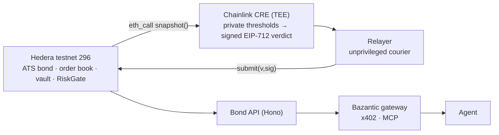

# Bond Desk: a compliant bond market on Hedera, policed from inside a TEE

A corporate bond issued through Hedera's Asset Tokenization Studio, traded on an order book that calls the
token's own compliance check before every fill, with coupons fired by Hedera's Schedule Service and collateral
valued against a live Chainlink HBAR/USD feed. A Chainlink CRE confidential workflow reads that collateral from
inside an enclave, decides against thresholds that never leave it, and signs an EIP-712 verdict that any
unprivileged relayer can land on-chain. The same market is exposed as a paid, agent-callable API through
Bazantic.

The property that ties it together: the policy is private, the verdict is public and verifiable. An observer can
check that a freeze was justified by the coverage the verdict carries, without learning where the thresholds
sit.

Built for ETHOnline 2026. Everything below ran on Hedera testnet (chain 296) on 2026-09-10.

## Live on testnet today

| Contract | Address | Source |
|---|---|---|
| BondRegistry | [`0x378F45197809358b10d4F4FaBc1F9AAD6bB9b53E`](https://hashscan.io/testnet/contract/0x378F45197809358b10d4F4FaBc1F9AAD6bB9b53E) | verified |
| NavOracle | [`0x56260E6CF630043421C1469Ee511E66c3eE95505`](https://hashscan.io/testnet/contract/0x56260E6CF630043421C1469Ee511E66c3eE95505) | verified |
| CollateralVault | [`0x82db4a2ba9859816D60E3d3CE2F6F1E29818FaF7`](https://hashscan.io/testnet/contract/0x82db4a2ba9859816D60E3d3CE2F6F1E29818FaF7) | verified |
| BondMarket | [`0x9e393461E165E9975A0A74f7FC378E6C342104B1`](https://hashscan.io/testnet/contract/0x9e393461E165E9975A0A74f7FC378E6C342104B1) | verified |
| BondLifecycle | [`0x044eB54FcA9488356A06121e767cba552a1E5C1B`](https://hashscan.io/testnet/contract/0x044eB54FcA9488356A06121e767cba552a1E5C1B) | verified |
| RiskGate | [`0x1dFF1d5458D6a6f6af46014de76474DC3170C31B`](https://hashscan.io/testnet/contract/0x1dFF1d5458D6a6f6af46014de76474DC3170C31B) | verified |
| MockUSDC (settlement) | [`0xF712daABfF190B34fd6C870761Ac4efa54E821B1`](https://hashscan.io/testnet/contract/0xF712daABfF190B34fd6C870761Ac4efa54E821B1) | verified |
| ATS bond token (bondId 1) | [`0x0100526434C821d0df24f6CC60352F830F8b4504`](https://hashscan.io/testnet/contract/0x0100526434C821d0df24f6CC60352F830F8b4504) | ATS factory proxy |

The seven contracts marked verified are source-verified on Sourcify (exact match) and show as verified on
HashScan; `contracts/script/verify.sh` reproduces it. The bond token is a resolver proxy deployed by the ATS
factory, so its source lives in the ATS repo, not here.

`BondLifecycle` was redeployed once, to raise `SCHEDULE_GAS` after the first scheduled coupon ran out of gas on
testnet (step 7 of the storyline). The superseded instance is
`0x10E79b89Fd088935b8Ca86c697ff5c38050AcB1d`; its HBAR float was recovered and every consumer reads the address
above from `deployments/testnet.json`.

| Item | Value |
|---|---|
| ATS factory (existing testnet deployment) | [`0xd1F118A40f3b02883D35909eF2517e7EDd78379d`](https://hashscan.io/testnet/contract/0xd1F118A40f3b02883D35909eF2517e7EDd78379d) |
| ATS BusinessLogicResolver | [`0xBA2D5FC2083A0b8f164c50e65d782087fBA18E0a`](https://hashscan.io/testnet/contract/0xBA2D5FC2083A0b8f164c50e65d782087fBA18E0a) |
| Chainlink HBAR/USD feed (8 dec) | [`0x59bC155EB6c6C415fE43255aF66EcF0523c92B4a`](https://hashscan.io/testnet/contract/0x59bC155EB6c6C415fE43255aF66EcF0523c92B4a) |
| Verdict signer (enclave key, never funded) | `0xaDC8997EfbE1925d07a002A2f31Bd3cE0e6F1dcE` |
| Coupon 1, HSS schedule that paid it | [`0.0.10457460`](https://hashscan.io/testnet/schedule/0.0.10457460) (EVM `0x…009F9174`, executed at `1789035662.019`) |
| Coupon 2, self-scheduled from inside coupon 1 | [`0.0.10457462`](https://hashscan.io/testnet/schedule/0.0.10457462) (EVM `0x…009F9176`, `wait_for_expiry: true`, due `1789121682`) |
| Chainlink liquidation challenge, `join()` on Sepolia | [`0x22feaf45d88d5ffada8b10a55a4561e605326218d592d26d81e52e1977fe64a9`](https://sepolia.etherscan.io/tx/0x22feaf45d88d5ffada8b10a55a4561e605326218d592d26d81e52e1977fe64a9) |
| Bond Desk API (AWS App Runner, `ap-south-1`) | [`https://wd6nrvmajt.ap-south-1.awsapprunner.com`](https://wd6nrvmajt.ap-south-1.awsapprunner.com) — `/healthz`, `/openapi.json`, six operations |
| Bazantic gateway (LIVE) | `https://axuvor5zujgk5hdcydzjdi742m.bazgateway.com`, MCP at `/mcp` — unpaid `GET /bonds` returns 402 with an x402 challenge |
| Bazantic Recipe (published) | [Best Eligible Hedera Bond Recommendation](https://bazantic.com/recipes/best-eligible-hedera-bond-recommendation) — chains the mirror-node gateway `https://txrkgk2mezhbln4aeo2tdji6s4.bazgateway.com` with the Bond Desk gateway |

Machine-readable source of truth: [`deployments/testnet.json`](deployments/testnet.json) and
[`ats/testnet.json`](ats/testnet.json).

## Architecture

Full diagrams (system flowchart, verdict sequence) in [`docs/architecture.md`](docs/architecture.md).



## The storyline, with receipts

Every beat below is a transaction on Hedera testnet or a read against it, in narrative order. Read-only beats
are `cast call` reads, so they print a revert reason without spending gas.

1. **Issuance through the live ATS factory.** `deployBond` on the factory already deployed on testnet, no fork
   and no ATS redeploy:
   [`0xf12ba21d…bcf173`](https://hashscan.io/testnet/transaction/0xf12ba21df080b14138f1a48adc31bb777ed192278d71f87ae98c021212bcf173).
   Source: [`ats/script/CreateBond.s.sol`](ats/script/CreateBond.s.sol).
2. **KYC, in the order ATS enforces.** `addIssuer(issuer)`
   [`0x08bde15a…2040d6`](https://hashscan.io/testnet/transaction/0x08bde15a0ffad60a406bc5ad5c3b3ddfb6936c5460bf0ba6b09d2209122040d6),
   then `grantKyc` for the issuer
   [`0x6a438b61…d748c66`](https://hashscan.io/testnet/transaction/0x6a438b61fa6aca3666917ad9bba0eb9b1e927e358f264bfd67dd2d348d748c66)
   and two investors
   [`0x57bf1df6…d30b99`](https://hashscan.io/testnet/transaction/0x57bf1df6f0532272898a1d6932657c117234050e31fcfa7579edd86453d30b99),
   [`0x3fcb17d8…1234ec`](https://hashscan.io/testnet/transaction/0x3fcb17d88be8221323fd937d88cd4423f473e3653747caeef8dc1f4fa21234ec),
   then `mint(issuer, 100)`
   [`0xf6ed0aa4…931b7a`](https://hashscan.io/testnet/transaction/0xf6ed0aa4d158b8b32e11f250470c11ba8d96181e92ce1bf9dd44ce30fe931b7a).
   A third wallet (`0x3b44299d9F246dc775DC2e4A0B54e31DB5b31cb3`) is deliberately left without KYC.
3. **Issuer posts an ask.** Order 1, 20 bonds at 0.99 USDC, 7-day expiry:
   [`0x0e44ff6e…f90bf2ba`](https://hashscan.io/testnet/transaction/0x0e44ff6eef3aaf178d164f196572222e7b91622cf479e222ba48f64ff90bf2ba).
4. **The non-KYC wallet cannot fill it.** `BondMarket.fill` calls the token's own
   `canTransferFrom(seller, buyer, amount, "")` before it moves anything. Against live chain state it returns
   `(false, 0x10, InvalidKycStatus)` (reason selector `0xfc855b1b`) and the fill reverts
   `ComplianceRejected(0x10, 0xfc855b1b)`, selector `0x5afab9b8`:

   ```sh
   cast call 0x9e393461E165E9975A0A74f7FC378E6C342104B1 'fill(uint256,uint128)' 1 10 \
     --from 0x3b44299d9F246dc775DC2e4A0B54e31DB5b31cb3 --rpc-url hedera
   ```

5. **The KYC'd wallet fills the same order.** Investor 1 takes 10 of order 1:
   [`0x07e85a43…067bd4`](https://hashscan.io/testnet/transaction/0x07e85a43f2528f87172d71beaf61f60d8f0552859d01b29bf7536dbb7d067bd4).
   Same order, same block height range, different wallet.
6. **100 HBAR of collateral, 762 bps of coverage.** `CollateralVault.deposit{value: 100 ether}(1)`
   [`0xe80415c2…0cab4acd`](https://hashscan.io/testnet/transaction/0xe80415c206375cbe2580ce4c4bf415de7782ecb1b20dc2398224e5de0cab4acd).
   The relay divides the 18-decimal value by 1e10, so the chain stores 1e10 tinybar. `coverageBps` is computed
   on-chain from `latestRoundData()` on the HBAR/USD feed, and read back as **762**.
7. **A coupon the Hedera Schedule Service paid by itself, on the second attempt.** This is the beat that took a
   redeploy, so it is worth reading in order. The redeploy and the working coupon were run last, after step 12,
   which is why their timestamps (`1789035282`, `1789035662`) sit after the relay transactions in steps 8 and 10
   (`issuedAt` `1789034121` and `1789034272`) and after the unfreeze.

   The first schedule was created at deploy time via HIP-1215 `scheduleCall` on the `0x16b` system contract
   ([`0x78dddb6a…a581686`](https://hashscan.io/testnet/transaction/0x78dddb6ab8bba5c4111ecbcbd31347b76e81091705849fcf985730f05a581686)),
   producing entity [`0.0.10456917`](https://hashscan.io/testnet/schedule/0.0.10456917). It **executed** on time
   (`executed_timestamp: 1789035282.045`) and the `payCoupon` inside it **reverted**:
   `CONTRACT_REVERT_EXECUTED`, out of gas. `SCHEDULE_GAS` was 2,000,000, but `payCoupon` against the real ATS
   token plus the nested re-schedule estimates at roughly 1.84M and the system contract adds a markup on top.
   Commit `ae952c9` raises `SCHEDULE_GAS` to 4,000,000 (`hasScheduleCapacity` accepts at least 12M on testnet)
   and `BondLifecycle` was redeployed to `0x044eB54F…2a1E5C1B`, re-granted `GATE_ROLE`
   ([`0x065398ec…f45d21d8`](https://hashscan.io/testnet/transaction/0x065398eca7c5e17f97bad3556fd23dca0c77cbc23443923bccea9ebaf45d21d8)),
   `ROLE_SNAPSHOT`
   ([`0x24086604…de799c2d`](https://hashscan.io/testnet/transaction/0x24086604c363ebffef154f6725bbeafb929068c63011f8c05e425cd6de799c2d))
   and `ROLE_MATURITY_REDEEMER`
   ([`0x8b812fdf…bc6558e1`](https://hashscan.io/testnet/transaction/0x8b812fdf76655b07a552df97a092658ec85b4be739b81b94b46cfbaebc6558e1)),
   with the old instance's HBAR float recovered
   ([`0x429e197f…cc388187`](https://hashscan.io/testnet/transaction/0x429e197ffd89fe7d5acd41d76b793142d91756230d26a30cdecd6360cc388187))
   and 20 HBAR put into the new one, which is the HSS payer
   ([`0x5f3238f0…7ca5c96d`](https://hashscan.io/testnet/transaction/0x5f3238f076e5910db073561ec0fd4318d9091efc8e22fb2601db847d7ca5c96d)).

   Then the coupon was funded with 100 USDC (approve
   [`0xd0542981…e78f8bad`](https://hashscan.io/testnet/transaction/0xd05429815d1bd94617c42ce93e26132adc1a1928de21334902f11282e78f8bad),
   `fund(1, 100e6)`
   [`0xa85bd3a8…bb2a4401`](https://hashscan.io/testnet/transaction/0xa85bd3a8330adcfa61f206fb695b828bd51c15f492793a7df5c93334bb2a4401))
   and rescheduled for five seconds out (`schedule(1)`
   [`0xe00bea9a…4962bc95`](https://hashscan.io/testnet/transaction/0xe00bea9a4f2b58f807329545b4d147a83f97771992e2977f8a8e88044962bc95),
   gas used 1,505,270, so it needs `--gas-limit 3000000`; a 600k limit reverts), producing entity
   [`0.0.10457460`](https://hashscan.io/testnet/schedule/0.0.10457460).

   **The Schedule Service executed it at `1789035662.019`, with no bot and no keeper**, and this time the
   coupon paid: `couponCount(1)` is 1 and coupon 1 is `{snapshotId 1, amount 13698, paidAt 1789035661}`. 13,698
   USDC base units is 100 tokens at 1 USDC face, 5% a year, for one day. Claims are pull-based over the ATS
   snapshot, so investor 1, holding 10 of the 100 bonds, claimed 1,369 units
   ([`0x5c6130d9…9d97920d`](https://hashscan.io/testnet/transaction/0x5c6130d98de6a60240394f5b5731afcca43400ac1ca7fc7ab2b315b59d97920d));
   the issuer's remaining claimable is 12,328.

   **The executed call also scheduled the next coupon from inside itself**, with no
   `NO_SCHEDULING_ALLOWED_AFTER_SCHEDULED_RECURSION`: entity
   [`0.0.10457462`](https://hashscan.io/testnet/schedule/0.0.10457462), due `1789121682`. That is the coupon's
   target second `1789035282` plus one 86,400-second interval: `payCoupon` advances `nextCoupon` by
   `couponInterval` from the second the coupon was *due*, not from the second the Schedule Service happened to
   execute it (`1789035662`). That is the self-scheduling timer, proved end to end. The mirror node is the
   authoritative record, not the `SUCCESS` response code from `scheduleCall`, and
   `harness/scripts/validate-schedule.sh 0x00000000000000000000000000000000009F9174` exits 0 against it.
8. **The enclave says WARN.** `cre workflow simulate bond-monitor` reads `RiskGate.snapshot(1)` over JSON-RPC
   from inside the TEE handler, decides against private thresholds, signs, and prints
   `coverage=<100% action=WARN reason=below-warn nonce=1` plus a `VERDICT_JSON` line carrying
   `coverageObserved: 762`. Log:
   [`docs/cre-evidence/bond-monitor-20260910-1527-warn.log`](docs/cre-evidence/bond-monitor-20260910-1527-warn.log).
   The relayer verified the signature locally, then submitted it:
   [`0xe534d72b…c6e085dd7b6`](https://hashscan.io/testnet/transaction/0xe534d72b2f9ec132756dc66b63e1476b05a50d13f8613b69a327ac6e085dd7b6).
9. **Collateral withdrawn, coverage falls to 610 bps.** 20 HBAR out of the vault:
   [`0xc72335c7…99fd0051`](https://hashscan.io/testnet/transaction/0xc72335c792f9dbb91ea980746ea56770925d7a51fff7ff805a56612299fd0051).
   The first attempt reverted because the relay's `eth_estimateGas` under-estimates a contract that sends native
   HBAR; the successful call passes `--gas-limit 400000` explicitly.
10. **The enclave says FREEZE.** Same commit, same chain, same code path, lower coverage:
    `action=FREEZE reason=below-freeze nonce=2`, `coverageObserved: 610`. Log:
    [`docs/cre-evidence/bond-monitor-20260910-1533-freeze.log`](docs/cre-evidence/bond-monitor-20260910-1533-freeze.log).
    Relayed:
    [`0x18d46f96…573db14e`](https://hashscan.io/testnet/transaction/0x18d46f9627d0e7808d2c78d73848c5aefd813d73147bd19abc74c8e0573db14e).
    `RiskGate` recovered the signer, checked that the nonce had increased, and set the registry status to `Frozen`.
11. **A KYC'd buyer with a valid order now cannot fill either.** Same `cast call` as step 4, from investor 1,
    reverts `BondNotActive` (selector `0x34823ce5`). Compliance and risk are separate gates and both are in the
    contract:

    ```sh
    cast call 0x9e393461E165E9975A0A74f7FC378E6C342104B1 'fill(uint256,uint128)' 1 5 \
      --from 0x897f8b6F2876d61E661889b578F4435E406baFdf --rpc-url hedera
    ```

    Only reproducible while the bond is `Frozen`. Step 12 unfroze it, so re-run today the call succeeds; relay a
    FREEZE verdict again ([`docs/cre-evidence/README.md`](docs/cre-evidence/README.md)) to reproduce the revert.

12. **Unfreezing is an admin action, not a verdict.** `RiskGate.unfreeze(1)`
    [`0x00915e79…6bd8b10c`](https://hashscan.io/testnet/transaction/0x00915e79ecb638a2713c5f4de923aea26c96b89bdc8994d8eac6a49b6bd8b10c).
    The gate only accepts enclave-signed verdicts, so it has no "clear" verdict; the bond keeps its last FREEZE
    as history and consumers must gate on `status`. `GET /bonds/1/risk` shows exactly that at the time of writing
    (2026-09-10): `status` `Active`, `lastNonce` 2, and `lastVerdict` still FREEZE at nonce 2. `coverageBps` read
    610 then; it is computed on-chain from the HBAR/USD feed and moves with it, so a fresh read will differ.

Nonce 1 to nonce 2 across steps 8 and 10 is the replay guard doing its job: the nonce comes from the same
snapshot the decision used, so a resubmitted verdict is rejected.

## Where to look, per track

| Track | Start here |
|---|---|
| Hedera, tokenization | [`ats/script/CreateBond.s.sol`](ats/script/CreateBond.s.sol) (the live ATS factory, not a fork), [`ats/README.md`](ats/README.md) (ABI provenance per facet), [`contracts/src/BondMarket.sol`](contracts/src/BondMarket.sol) (`fill` calls `canTransferFrom`), [`contracts/src/BondLifecycle.sol`](contracts/src/BondLifecycle.sol) (HIP-1215 `scheduleCall`, snapshot-based pull claims) |
| Hedera, improve the harness | [`harness/README.md`](harness/README.md) (tiers, API table, before/after line counts), [`harness/src/HederaHarness.sol`](harness/src/HederaHarness.sol), [`harness/src/HederaTest.sol`](harness/src/HederaTest.sol), [`harness/src/mocks/MockHSS.sol`](harness/src/mocks/MockHSS.sol), [`harness/scripts/`](harness/scripts) (`doctor.sh`, `verify.sh`, `validate-schedule.sh`, `loc.sh`) |
| Chainlink, confidential workflow | [`workflow/bond-monitor/handler.ts`](workflow/bond-monitor/handler.ts), [`workflow/shared/decide.ts`](workflow/shared/decide.ts), [`workflow/shared/rpc.ts`](workflow/shared/rpc.ts), evidence in [`docs/cre-evidence/`](docs/cre-evidence) |
| Chainlink, liquidation challenge | [`workflow/liquidation-protection/main.ts`](workflow/liquidation-protection/main.ts), [`docs/cre-evidence/challenge.md`](docs/cre-evidence/challenge.md) |
| Bazantic | Live API [`https://wd6nrvmajt.ap-south-1.awsapprunner.com`](https://wd6nrvmajt.ap-south-1.awsapprunner.com), live gateway `https://axuvor5zujgk5hdcydzjdi742m.bazgateway.com` (402 + MCP) and published Recipe [Best Eligible Hedera Bond Recommendation](https://bazantic.com/recipes/best-eligible-hedera-bond-recommendation); [`api/src/openapi.ts`](api/src/openapi.ts), registration, prices and activation record in [`api/bazantic/gateway.md`](api/bazantic/gateway.md), Recipe source and its dashboard test run in [`api/bazantic/recipe.md`](api/bazantic/recipe.md), [`api/bazantic/ab-test.md`](api/bazantic/ab-test.md), A/B results — (run 2026-09-10: Recipe 4/4 correct vs 2/4 raw) — in [`docs/bazantic-ab/README.md`](docs/bazantic-ab/README.md) |

Demo script and shot list: [`docs/DEMO.md`](docs/DEMO.md). Sponsor feedback:
[`docs/FEEDBACK/`](docs/FEEDBACK).

## Run it

Toolchain, once: Foundry 1.5.x (`forge`), Node 22.9+ (`--experimental-strip-types`, no build step; `api` pins it
in `engines`), Bun 1.2.21+ for the CRE workflows, and `jq`. `harness/scripts/doctor.sh` checks the
Hedera-specific half of that.

Contracts and harness, no credentials needed:

```sh
forge build
forge test                                   # 149 passed, 7 skipped (fork tests)
FOUNDRY_PROFILE=harness forge test           # 41 passed: HSS/HTS mocks, probe loop, response codes
FORK=1 forge test --match-path 'contracts/test/fork/*' --fork-url https://testnet.hashio.io/api
```

Off-chain, no credentials needed. Each line is run from the repo root and returns you there:

```sh
(cd workflow && bun install && bun test && bun run typecheck)   # 16 tests: decide ladder, rpc, fake-runtime handler
(cd relayer  && npm install && npm run check)                   # offline: prints verified=true on test/fixture.json
(cd relayer  && npm test && npm run typecheck)
(cd api      && npm install && npm run check)                   # placeholder deployment: asserts routes + openapi.json
(cd api      && npm start)                                      # http://localhost:8787/healthz
```

CRE simulations need `cre login` (browser) and a `CRE_ETH_PRIVATE_KEY` in `workflow/.env`, even though the bond
workflow spends nothing:

```sh
cd workflow
cp .env.example .env                          # fill CRE_ETH_PRIVATE_KEY, CRE_VERDICT_SIGNER_KEY, the thresholds
bun run sim:bond 2>&1 | tee ../docs/cre-evidence/bond-monitor-$(date +%Y%m%d-%H%M).log
bun run sim:liq  2>&1 | tee ../docs/cre-evidence/liquidation-protection-$(date +%Y%m%d-%H%M).log
bun run setup:challenge                       # once: approve vUSD/vETH then join() on Sepolia
```

Deploy sequence, in this order (needs a funded Hedera key; see `harness/FAUCET.md`):

```sh
source .env                                   # HEDERA_PRIVATE_KEY, RISK_SIGNER, INVESTOR*
export HEDERA_RPC_URL=https://testnet.hashio.io/api

# 1. create the bond on the existing ATS factory; writes ats/testnet.json .bond
forge script ats/script/CreateBond.s.sol:CreateBond --rpc-url hedera --broadcast --slow

# 2. deploy the six desk contracts, wire roles, register the bond, fund the lifecycle, schedule coupon 1.
#    --skip-simulation is mandatory: forge's local EVM has no code at 0x16b.
export BOND_TOKEN=$(jq -r .bond.token ats/testnet.json)
export HBAR_USD_FEED=0x59bC155EB6c6C415fE43255aF66EcF0523c92B4a
forge script contracts/script/Deploy.s.sol:Deploy --rpc-url hedera --broadcast --slow --skip-simulation

# 3. overwrite the artifact's .schedule with the on-chain HSS address (no broadcast, no etch)
forge script contracts/script/Deploy.s.sol:Deploy --sig 'patchSchedule()' --rpc-url hedera

#    to re-schedule a coupon by hand, note that a call reaching 0x16b needs an explicit gas limit:
#    cast send "$(jq -r .lifecycle deployments/testnet.json)" 'schedule(uint256)' 1 \
#      --private-key "$HEDERA_PRIVATE_KEY" --gas-limit 3000000 --rpc-url hedera
#    then re-run patchSchedule() so validate-schedule.sh points at the new entity.

# 4. verify every contract on Sourcify, with HashScan's verifier as the fallback
contracts/script/verify.sh deployments/testnet.json

# 5. the storyline, one beat at a time
FS="forge script contracts/script/Demo.s.sol:Demo --rpc-url hedera --broadcast --slow --skip-simulation"
$FS --sig 'runApprovals()'
$FS --sig 'runIssuerSell()'
forge script contracts/script/Demo.s.sol:Demo --sig 'runRejectedBuy()' --rpc-url hedera   # read-only
$FS --sig 'runKycBuy()'
$FS --sig 'runCollateral()'
$FS --sig 'runCoupon()'
harness/scripts/validate-schedule.sh "$(jq -r .schedule deployments/testnet.json)" --wait 300
```

Relaying a verdict from a simulation log:

```sh
relayer/scripts/extract-verdict.sh < docs/cre-evidence/bond-monitor-20260910-1533-freeze.log \
  > relayer/inbox/freeze.json
cd relayer
RISKGATE_ADDRESS=0x1dFF1d5458D6a6f6af46014de76474DC3170C31B npm run relayer -- \
  submit --file inbox/freeze.json
```

## Why a relay, and what stays private

Hedera is not a CRE-supported chain. There is no chain writer, no EVM client target, and no on-chain report
consumer for chain 296, and `EVMClient` has no `TeeRuntime` overload at all. So the workflow reads Hedera as raw
JSON-RPC over the CRE HTTP client (one `eth_call` to `RiskGate.snapshot(bondId)`, batched into a single HTTP
request to stay inside the 5-calls-per-execution budget) and writes nothing itself. It signs an EIP-712
`Verdict(uint256 bondId,uint8 action,uint256 coverageObserved,uint64 issuedAt,uint64 nonce)` with a key that
exists only as a CRE secret and is only ever materialised inside the enclave, and emits the verdict plus the
signature as one log line.

That signature is the trust boundary. `RiskGate.submit` recovers the signer, compares it to `signer()`, checks
`nonce > lastNonce` (strictly increasing) and an `issuedAt` freshness window, and does not care who sent the
transaction. The workflow always signs `lastNonce + 1`, but the contract only requires the nonce to increase, so
a verdict can never be replayed and a verdict that was signed and never relayed does not wedge the gate. The
relayer is therefore a courier: it holds a funded Hedera key that can pay gas and nothing else, anyone can run
one, and losing its key delays verdicts rather than forging them.

| Never leaves the enclave | Public, on-chain or in logs |
|---|---|
| the verdict signer key, and the submit key in direct mode | the signer's address, via `RiskGate.signer()` |
| the coverage thresholds that define WARN / FREEZE / DEFAULT | the `action` that resulted |
| the liquidation policy: trigger and target health factors, repay and deposit caps, cooldown | the repay and deposit transactions themselves |
| the exact coverage in the workflow's own log line, which is bucketed to `>=150%` / `120-150%` / `100-120%` / `<100%` | `coverageObserved` in the verdict, because the contract needs it to be auditable |

The private policy values live in `workflow/.env` and are shipped to CRE as secrets (`workflow/secrets.yaml`
maps secret ids to env var names, never values). They are not in this repository, and the committed simulation
logs were checked with a word-boundary match of every `.env` value of 4 or more characters: nothing the
workflows write matches — no `[USER LOG]` line, no `VERDICT_JSON` field, and none of the private keys. The one
word-boundary hit is a constant inside the CRE simulator's own fixed capability-limits banner, identical in every
log and independent of `.env`. The check, and that caveat, are in
[`docs/cre-evidence/README.md`](docs/cre-evidence/README.md).

## Known limits

- **The signature is not enclave-attested.** CRE has no enclave-held signing primitive, so the verdict proves
  the key was used, not that a genuine TEE used it. This is not fixable from user code; see
  [`docs/FEEDBACK/chainlink.md`](docs/FEEDBACK/chainlink.md).
- **DEFAULT is a coverage floor, or an admin action.** Workflow runs are stateless, so "the coupon has been late
  for N days" has nowhere to live. DEFAULT fires below a floor threshold (disabled in the demo policy); a real
  deployment keeps missed-payment state on-chain.
- **WARN repeats on every run** by design: it is a signal, not a state change. Only FREEZE and DEFAULT are
  suppressed when the bond is already in that state.
- **hashio is a dev endpoint.** `eth_getLogs` caps at 7 days / 1000 blocks, so all history comes from the mirror
  node, which trails consensus by 2 to 5 seconds.
- **The relay under-estimates gas for native-value sends and for system-contract calls.** `eth_estimateGas`
  returns too little for a contract call that forwards HBAR, so `CollateralVault.withdraw` needs an explicit
  `--gas-limit` (400000 works), and `BondLifecycle.schedule` reaches `0x16b` and used 1,505,270 gas, so it needs
  `--gas-limit 3000000` (600k reverts). The deploy and demo scripts run with `--skip-simulation` so gas comes
  from the relay rather than forge's local EVM.
- **A scheduled call's gas budget has to cover what the call itself schedules.** The first coupon schedule
  executed on time and reverted out of gas at `SCHEDULE_GAS = 2_000_000`, because `payCoupon` also re-schedules
  the next coupon. It is now 4,000,000 with headroom, but there is no way to learn the real figure other than
  running it on testnet: the failure is only visible on the mirror node's transactions endpoint, and
  `/contracts/results/{id}` returns the original `schedule()` call instead. See
  [`docs/FEEDBACK/hedera.md`](docs/FEEDBACK/hedera.md).
- **The liquidation challenge contract only accepts actions while a scenario is active.** `repay` and `deposit`
  revert with `Scenario has not started` outside a scoring window, so `liquidation-protection` probes the gate
  with an in-batch `eth_call` and returns `INACTIVE` rather than burning gas. Evidence for both the reverted
  attempt and the probe is in [`docs/cre-evidence/`](docs/cre-evidence).
- **Demo thresholds are scaled to faucet-sized collateral.** 100 HBAR against a 100-bond issue gives coverage in
  the hundreds of bps, so the demo policy sits far below anything a real bond would use. The ladder is the same;
  only the numbers are small.
- **The Bazantic gateway is live; only the marketplace listing is pending.** The API is hosted on AWS App
  Runner at [`https://wd6nrvmajt.ap-south-1.awsapprunner.com`](https://wd6nrvmajt.ap-south-1.awsapprunner.com);
  the gateway `https://axuvor5zujgk5hdcydzjdi742m.bazgateway.com` is active, priced per operation, serving 402
  challenges and MCP, and the Recipe is published. What is outstanding is Bazantic's verification of the
  marketplace listing, which is on their side. Pricing, activation and Recipe authoring are dashboard-only — the
  CLI has no command for any of them ([`api/bazantic/gateway.md`](api/bazantic/gateway.md),
  [`docs/FEEDBACK/bazantic.md`](docs/FEEDBACK/bazantic.md)). The A/B run in
  [`docs/bazantic-ab/README.md`](docs/bazantic-ab/README.md) calls the public API directly in both arms, so its
  x402 spend is `0` by design rather than by omission.
- **CRE deploy access is requested, not granted.** The deploy-access form was submitted on 2026-09-10, so both
  workflows are exercised through `cre workflow simulate` only. The Sepolia `join()` and the position it created
  are live regardless.
- **One process, one cache.** The API caches reads for 10 s in memory. It is a demo service, not an HA
  deployment.
- **The relayer inbox is gitignored.** `relayer/inbox/*.json` and every `.env` are excluded, so the extracted
  verdict files are not in the tree; both relayed verdicts are reproducible from the logs in
  [`docs/cre-evidence/`](docs/cre-evidence) with `relayer/scripts/extract-verdict.sh`.

The rest are contract behaviours as deployed. They are documented rather than changed, so the Sourcify
exact-match verification above stays valid:

- **`BondLifecycle.schedule()` reverts `AlreadyScheduled` on a stale pointer.** A scheduled run that executed and
  then reverted leaves `scheduleOf` set and `scheduledFor == nextCoupon`, so the permissionless re-schedule
  refuses even though nothing is armed. Recovery is a manual `payCoupon`, which clears the pointer and re-arms
  the chain. A future version compares against the actual scheduled second instead of `nextCoupon`.
- **Redeem before the final coupon.** The first `redeem()` sets `Matured` and `payCoupon` rejects `Matured`, so
  any coupon still due at maturity has to be paid (`payCoupon`) before holders redeem. The demo terms leave no
  coupon due at maturity.
- **Seized collateral is shared pro-rata across the whole snapshot supply**, including the issuer's unsold
  inventory. A production version would exclude the issuer's own balance.
- **The settlement pool has no withdrawal path.** Over-funding, dust and unclaimable amounts stay in
  `BondLifecycle`; only the HBAR payer float is recoverable (`withdrawHbar`).
- **`BondMarket.quote()` scans every order id ever placed.** Enough spam orders push it past the relay's
  `eth_call` gas cap. That is an order-book read only, so funds are unaffected. A per-bond index, or an
  event-based off-chain book, is the upgrade.
- **Four smaller ones.** `schedule()` has no status or maturity guard, so anyone can make an exhausted bond burn
  one HSS run that reverts; `cost()` floors in the buyer's favour for bonds with `decimals > 0` (the demo bond
  has 0 decimals); a DEFAULT verdict cannot land while the ATS token is paused, because `takeSnapshot` is
  `onlyUnpaused`; and a fill against your own order is not rejected.
- **The demo ISIN `US0378331005` was chosen only because the ATS factory validates the checksum.** It belongs to
  a real listed equity and is not an issuance of that company. Testnet demo data.

## Repository layout

```
contracts/   BondRegistry, BondMarket, CollateralVault, NavOracle, BondLifecycle, RiskGate
             + unit / fuzz / invariant / fork tests, Deploy.s.sol, Demo.s.sol, verify.sh
ats/         ABI-exact ATS interfaces (pinned commit), testnet addresses, CreateBond.s.sol
harness/     Foundry harness for Hedera: HSS/HTS wrappers, mocks at 0x16b and 0x167, doctor/verify/validate
workflow/    Chainlink CRE confidential workflows (bond-monitor, liquidation-protection) + shared policy
relayer/     verdict courier, CRE log line to RiskGate.submit
api/         Bond API (Hono) + OpenAPI + Bazantic gateway runbook, Recipe and A/B protocol
deployments/ testnet.json, the artifact every other component reads
docs/        blueprint, technical reference, architecture, demo script, CRE evidence, sponsor feedback
```
