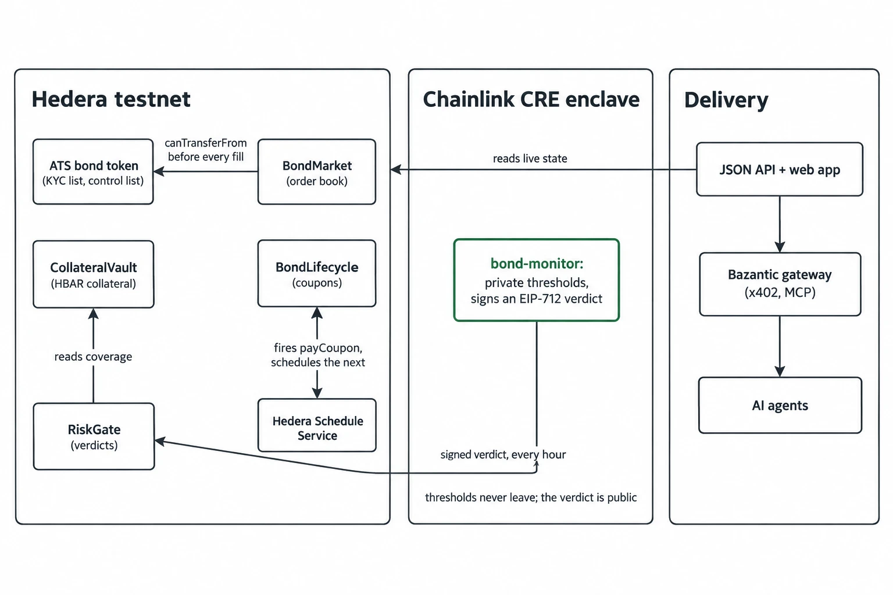
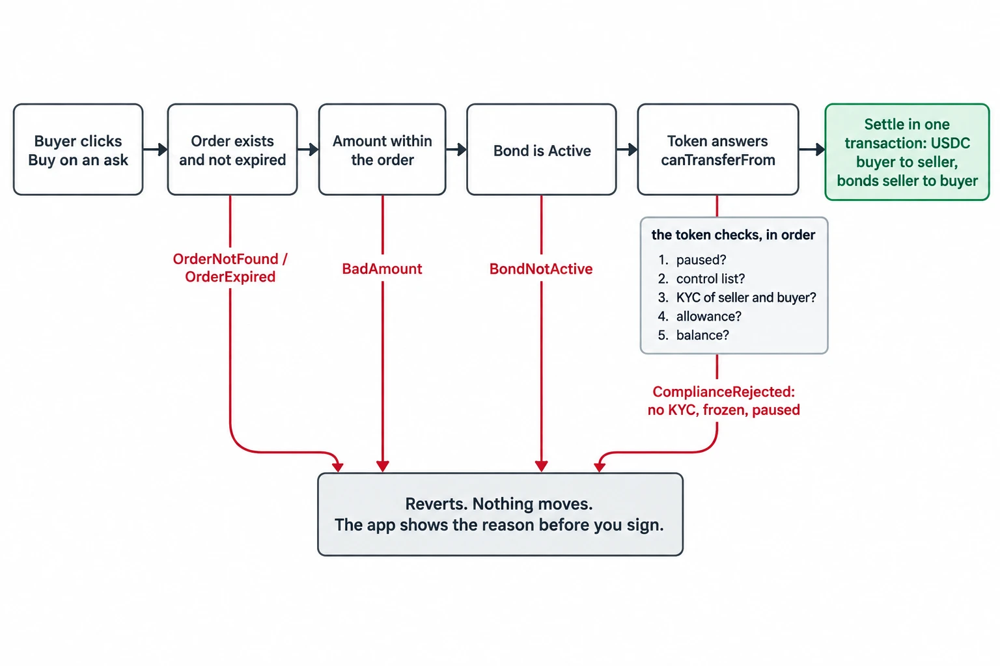
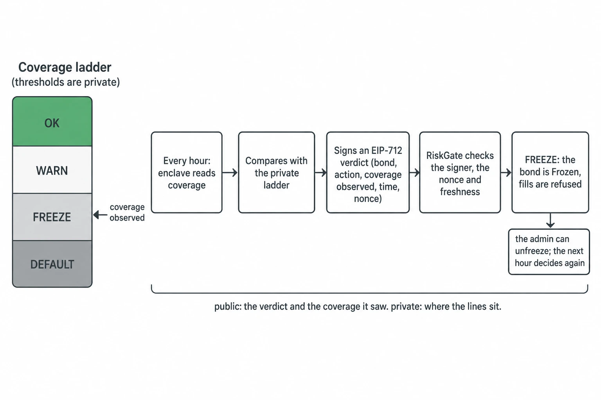

# Bond Desk

A bond market on Hedera testnet, built for ETHOnline 2026.

A company issues a bond as a token. People buy and sell it on an order book. The token itself checks every trade
against its own KYC list. Coupons are paid on time by Hedera's Schedule Service. The bond is backed by HBAR that a
Chainlink price feed values. A Chainlink CRE workflow, running inside a secure enclave, watches that collateral,
keeps its rules private, and signs a verdict that can freeze trading. The same market is open to AI agents as a
paid API through Bazantic.

**The idea in one line:** the rules that decide a freeze are private; the verdict is public and anyone can check it.

Nothing here is real money. Everything runs on Hedera testnet, and every transaction in this file opens on HashScan.

## Links

| | |
|---|---|
| Live app | https://wd6nrvmajt.ap-south-1.awsapprunner.com |
| Documentation | https://bond-desk.mintlify.site |
| API document (OpenAPI) | https://wd6nrvmajt.ap-south-1.awsapprunner.com/openapi.json |
| Demo video | _added with the submission_ |
| Bazantic gateway (paid API for agents) | https://axuvor5zujgk5hdcydzjdi742m.bazgateway.com |
| Bazantic Recipe | https://bazantic.com/recipes/best-eligible-hedera-bond-recommendation |
| Every transaction, in order | [docs/STORYLINE.md](docs/STORYLINE.md) |
| Demo script | [docs/DEMO.md](docs/DEMO.md) |



## What happens, step by step

1. **A bond is issued through Hedera's Asset Tokenization Studio (ATS).** We call the ATS factory that Hedera
   already runs on testnet. It gives us a security token with KYC switched on, a freeze list and transfer rules.
   Three bonds exist today: BDB27, BDB28 and BDB30.
2. **It trades on an on-chain order book.** Before a trade settles, the market asks the token: may this seller
   send these bonds to this buyer? If the token says no, nothing moves and the app shows the reason before you sign.
3. **Coupons pay themselves.** The issuer funds a USDC pool. Hedera's Schedule Service calls the contract at the
   due second, the contract pays the coupon and schedules the next one from inside the same call.
4. **Collateral is valued live.** The issuer locks HBAR in a vault. Coverage is the collateral's USD value, from
   the Chainlink HBAR/USD feed, divided by the face value still outstanding.
5. **An enclave watches and signs.** Every hour a Chainlink CRE workflow reads the coverage inside a trusted
   execution environment, compares it with thresholds that never leave the enclave, and signs a verdict. The
   RiskGate contract checks the signature and the nonce and, on FREEZE, halts trading.
6. **Agents can use it too.** The JSON API behind the app is also a Bazantic gateway: pay per call with x402, or
   call it as MCP tools. A published Recipe chains it with two other gateways to recommend the best bond a wallet
   may hold.





## Tracks

### Hedera: Tokenization of Anything

**What we built.** A corporate bond issued through the live ATS factory (no fork, no redeploy), traded on an
order book that calls the token's own compliance check inside every fill, with coupons paid by the Schedule
Service and collateral in native HBAR.

**Where to look.**

- Issuance and configuration: [`ats/script/CreateBond.s.sol`](ats/script/CreateBond.s.sol); the transaction that
  created bond 1, [`0xf12b…f173`](https://hashscan.io/testnet/transaction/0xf12ba21df080b14138f1a48adc31bb777ed192278d71f87ae98c021212bcf173);
  bonds 2 and 3, [`0xa709…36d3`](https://hashscan.io/testnet/transaction/0xa7095a24565eb49d9250dc2d02f9427e4f9f59c4e9dbe5083cd7296abb8036d3)
  and [`0x5fa1…b273`](https://hashscan.io/testnet/transaction/0x5fa1d505b1baf0c09d080aaff8652447438a1795addba54ea72e11341389b273).
- The compliance check in the fill: [`contracts/src/BondMarket.sol`](contracts/src/BondMarket.sol). A wallet
  without KYC is refused with `ComplianceRejected(0x10, InvalidKycStatus)`; the same order filled by a wallet with
  KYC, [`0x07e8…7bd4`](https://hashscan.io/testnet/transaction/0x07e85a43f2528f87172d71beaf61f60d8f0552859d01b29bf7536dbb7d067bd4).
- A coupon the network paid on its own: HIP-1215 `scheduleCall` in
  [`contracts/src/BondLifecycle.sol`](contracts/src/BondLifecycle.sol); schedule
  [`0.0.10482928`](https://hashscan.io/testnet/schedule/0.0.10482928) executed at its second with nobody sending a transaction.
- Issues we opened on the ATS repository while building:
  [#1402](https://github.com/hashgraph/asset-tokenization-studio/issues/1402),
  [#1403](https://github.com/hashgraph/asset-tokenization-studio/issues/1403),
  [#1404](https://github.com/hashgraph/asset-tokenization-studio/issues/1404), and a confirmation on
  [#1390](https://github.com/hashgraph/asset-tokenization-studio/issues/1390#issuecomment-5644153422).
- Docs: [the bond token](https://bond-desk.mintlify.site/how-it-works/bond-token),
  [the order book](https://bond-desk.mintlify.site/how-it-works/order-book),
  [coupons](https://bond-desk.mintlify.site/how-it-works/coupons). Feedback for the Hedera team:
  [`docs/FEEDBACK/hedera.md`](docs/FEEDBACK/hedera.md).

### Hedera: Improve the Harness

**What we built.** A Foundry harness for Hedera: mocks of the Schedule Service and Token Service at their real
addresses that speak the real response codes, a base test that fires scheduled calls, a library that hides the
capacity-probing dance, and scripts that check the machine, verify source and confirm on the mirror node that a
scheduled call ran and its child transaction succeeded.

**Where to look.**

- [`harness/README.md`](harness/README.md): the tiers, the API, and the before-and-after line counts
  (98 lines per project down to 52).
- Code: [`harness/src/HederaHarness.sol`](harness/src/HederaHarness.sol),
  [`harness/src/HederaTest.sol`](harness/src/HederaTest.sol),
  [`harness/src/mocks/MockHSS.sol`](harness/src/mocks/MockHSS.sol), scripts in [`harness/scripts/`](harness/scripts).
- Run it: `FOUNDRY_PROFILE=harness forge test` (42 tests), `harness/scripts/doctor.sh` (8 checks against testnet),
  `harness/scripts/validate-schedule.sh 0.0.10482965` (the harness's own template contract, executed, child
  succeeded).
- Upstream: [hedera-dev/hedera-harness#62](https://github.com/hedera-dev/hedera-harness/pull/62), a check that a
  scheduled transaction executed *and* its child succeeded, with our schedules as fixtures. Two commits: the
  check, then support for the address `scheduleCall` returns and a fast failure on expiries beyond the wait
  budget. Exercised on the PR branch with a mock generator and with a real CHAIN run on testnet; the runs and
  their logs are in [`harness/README.md`](harness/README.md#how-the-upstream-branch-was-exercised).

### Chainlink: Best Confidential Workflow

**What we built.** `bond-monitor`, a CRE workflow whose handler runs in a TEE. It reads the bond's coverage from
Hedera over JSON-RPC, decides against thresholds that exist only as CRE secrets, signs an EIP-712 verdict with a
key that only exists inside the enclave, and delivers it to the RiskGate contract itself. Hedera is not a
CRE-supported chain, so the signature is the trust boundary: the contract checks who signed, not who sent.

**Where to look.**

- Code: [`workflow/bond-monitor/handler.ts`](workflow/bond-monitor/handler.ts), the shared policy
  [`workflow/shared/decide.ts`](workflow/shared/decide.ts), the gate
  [`contracts/src/RiskGate.sol`](contracts/src/RiskGate.sol).
- Deployed on the CRE network since 2026-09-12 as `bond-monitor-production`, running every hour:
  [`docs/cre-evidence/deployed-20260912.txt`](docs/cre-evidence/deployed-20260912.txt).
- Receipts from the network, no relayer and no human: the first verdict
  [`0xe1bc…cb2`](https://hashscan.io/testnet/transaction/0xe1bc8a6d205c62d0d0123a91a77100dcb8da5a77810fbbe0e85de4de5f2e5cb2)
  (WARN, 07:00 UTC) and the freeze
  [`0x7916…b5a`](https://hashscan.io/testnet/transaction/0x79168dab6bc406a757a4c7aa76039f94da662512430ec9cae4e6611ad6657b5a)
  (FREEZE at coverage 4.48%, 12:00 UTC, bond 1 Active to Frozen in one transaction).
- Simulator runs whose banner names the enclave (AWS Nitro, us-west-2):
  [`docs/cre-evidence/`](docs/cre-evidence).
- Docs: [risk verdicts](https://bond-desk.mintlify.site/how-it-works/risk). Feedback for the Chainlink team:
  [`docs/FEEDBACK/chainlink.md`](docs/FEEDBACK/chainlink.md).

### Chainlink: Liquidation Protection Challenge

**What we built.** `liquidation-protection`, a second CRE workflow on the same policy module. Every 30 seconds it
reads the position on Sepolia, probes the challenge contract's gate inside its read batch, and, only during a
scoring window, repays or tops up from inside the enclave.

**Where to look.**

- Code: [`workflow/liquidation-protection/main.ts`](workflow/liquidation-protection/main.ts).
- `join()` on Sepolia:
  [`0x22fe…64a9`](https://sepolia.etherscan.io/tx/0x22feaf45d88d5ffada8b10a55a4561e605326218d592d26d81e52e1977fe64a9).
- Deployed as `liquidation-protection-production`, a `SUCCESS` row every 30 seconds; the record and how the
  position is defended: [`docs/cre-evidence/challenge.md`](docs/cre-evidence/challenge.md).

### Bazantic: Best Recipe that uses sponsor APIs

**What we built.** The Recipe
[Best Eligible Hedera Bond Recommendation](https://bazantic.com/recipes/best-eligible-hedera-bond-recommendation).
It takes a wallet address and chains three gateways: the Hedera mirror node (does the wallet exist, what has it
done), the Bond Desk API (what may it hold, what is the risk), and the Bank of Canada Valet (is the coupon worth
it against a benchmark). Remove any one and the answer changes.

**Where to look.**

- The Recipe text and why it needs three services: [`api/bazantic/recipe.md`](api/bazantic/recipe.md).
- Test runs on a KYC and a no-KYC wallet, every number checked against the endpoints:
  [`api/bazantic/test-runs-20260912.md`](api/bazantic/test-runs-20260912.md).
- Recipe against raw spec, 4 of 4 correct versus 2 of 4: [`docs/bazantic-ab/README.md`](docs/bazantic-ab/README.md).

### Bazantic: Agentify a new API

**What we built.** Three gateways, all registered by us: the Bond Desk API
(`axuvor5zujgk5hdcydzjdi742m`, x402 and MCP, priced per operation), a Hedera Mirror Node gateway for testnet
(`txrkgk2mezhbln4aeo2tdji6s4`), and the Bank of Canada Valet (`4q4fqndwcnhxrfk6thlgjnodca`), a keyless
government benchmark API that was on neither Bazantic nor any sponsor's list.

**Where to look.**

- Registration, pricing, activation and the checks, step by step: [`api/bazantic/gateway.md`](api/bazantic/gateway.md).
- The OpenAPI document the gateway reads: [`api/src/openapi.ts`](api/src/openapi.ts). An unpaid
  `GET https://axuvor5zujgk5hdcydzjdi742m.bazgateway.com/bonds` answers 402 with the x402 challenge.
- Docs: [agents and the paid gateway](https://bond-desk.mintlify.site/how-it-works/agents). Feedback for the
  Bazantic team: [`docs/FEEDBACK/bazantic.md`](docs/FEEDBACK/bazantic.md).

## Try it in five minutes

You need MetaMask and nothing else. The full walkthrough is the [quickstart](https://bond-desk.mintlify.site/quickstart).

1. Open [the desk](https://wd6nrvmajt.ap-south-1.awsapprunner.com/desk) and connect MetaMask. The app adds Hedera testnet for you.
2. Get test HBAR from the [Hedera faucet](https://portal.hedera.com/faucet).
3. Click **Get 10,000 test USDC**.
4. Click **Request testnet KYC**. You sign one message; the officer bot grants KYC on every bond token.
5. Open a bond, click **Buy** on an ask, confirm. The trade appears with its HashScan link.
6. Revoke your KYC and try again: the app shows the token's refusal before anything is signed.

## Screenshots


The app is built like a terminal: dark, dense, and driven from the keyboard. Press `?` in the app for the key list.

## What is live on testnet

Hedera testnet, chain 296. Source of truth: [`deployments/testnet.json`](deployments/testnet.json).

| Contract | Address |
|---|---|
| BondRegistry | [`0x378F45197809358b10d4F4FaBc1F9AAD6bB9b53E`](https://hashscan.io/testnet/contract/0x378F45197809358b10d4F4FaBc1F9AAD6bB9b53E) |
| BondMarket (the order book) | [`0x9e393461E165E9975A0A74f7FC378E6C342104B1`](https://hashscan.io/testnet/contract/0x9e393461E165E9975A0A74f7FC378E6C342104B1) |
| CollateralVault | [`0x82db4a2ba9859816D60E3d3CE2F6F1E29818FaF7`](https://hashscan.io/testnet/contract/0x82db4a2ba9859816D60E3d3CE2F6F1E29818FaF7) |
| NavOracle | [`0x56260E6CF630043421C1469Ee511E66c3eE95505`](https://hashscan.io/testnet/contract/0x56260E6CF630043421C1469Ee511E66c3eE95505) |
| BondLifecycle (coupons) | [`0xeB363F5aEd5D2a94b41EBF0876bd36864255C956`](https://hashscan.io/testnet/contract/0xeB363F5aEd5D2a94b41EBF0876bd36864255C956) |
| RiskGate (verdicts) | [`0x1dFF1d5458D6a6f6af46014de76474DC3170C31B`](https://hashscan.io/testnet/contract/0x1dFF1d5458D6a6f6af46014de76474DC3170C31B) |
| MockUSDC (settlement, open mint) | [`0xF712daABfF190B34fd6C870761Ac4efa54E821B1`](https://hashscan.io/testnet/contract/0xF712daABfF190B34fd6C870761Ac4efa54E821B1) |

All seven are source-verified on Sourcify and show as verified on HashScan.

| Bond | Token (ATS) | Coupon | Supply | Matures |
|---|---|---|---|---|
| 1, BDB27 | [`0x0100…4504`](https://hashscan.io/testnet/contract/0x0100526434C821d0df24f6CC60352F830F8b4504) | 5% a year, paid daily | 100 | 2027-09-10 |
| 2, BDB28 | [`0xf175…F40D`](https://hashscan.io/testnet/contract/0xf175d5B081d8A5187Bdb5b7fA6F621eFe9c6F40D) | 7.25% a year, paid weekly | 60 | 2028-09-12 |
| 3, BDB30 | [`0xd675…983f`](https://hashscan.io/testnet/contract/0xd6752FfC596C8F9D4F5D530246e5698ec65a983f) | 3.75% a year, paid every 30 days | 40 | 2030-09-12 |

| Also live | |
|---|---|
| ATS factory (Hedera's own testnet deployment) | [`0xd1F118A40f3b02883D35909eF2517e7EDd78379d`](https://hashscan.io/testnet/contract/0xd1F118A40f3b02883D35909eF2517e7EDd78379d) |
| Chainlink HBAR/USD feed | [`0x59bC155EB6c6C415fE43255aF66EcF0523c92B4a`](https://hashscan.io/testnet/contract/0x59bC155EB6c6C415fE43255aF66EcF0523c92B4a) |
| CRE workflows (private registry) | `bond-monitor-production` (hourly), `liquidation-protection-production` (every 30 s) |
| Next coupon of bond 1, HSS schedule | [`0.0.10498485`](https://hashscan.io/testnet/schedule/0.0.10498485) |
| App and API | AWS App Runner, `ap-south-1` |

## Run it yourself

Toolchain: Foundry 1.5+, Node 22.9+, Bun 1.2.21+, `jq`. No credentials are needed for the tests.

```sh
forge build && forge test                     # contracts: unit, fuzz, invariant tests
FOUNDRY_PROFILE=harness forge test            # the Hedera harness
(cd workflow && bun install && bun test)      # the CRE policy and handler tests
(cd api && npm install && npm run check)      # the API against a placeholder deployment
(cd web && npm install && npm run typecheck && npm test)
```

Deploying, simulating the enclave, relaying a verdict and replaying the demo are in
[`docs/RUNBOOK.md`](docs/RUNBOOK.md) and on the docs site under [Run it yourself](https://bond-desk.mintlify.site/run/prerequisites).

## Repository layout

```
contracts/   BondRegistry, BondMarket, CollateralVault, NavOracle, BondLifecycle, RiskGate, tests, deploy and demo scripts
ats/         ABI-exact ATS interfaces (pinned commit), testnet addresses, CreateBond.s.sol
harness/     Foundry harness for Hedera: HSS/HTS mocks at their real addresses, doctor, verify, validate scripts
workflow/    Chainlink CRE confidential workflows (bond-monitor, liquidation-protection) and the shared policy
relayer/     verdict courier: a CRE log line to RiskGate.submit
api/         the JSON API (Hono), OpenAPI, the testnet KYC desk, the Bazantic runbook and Recipe
web/         the app (Vite, React, wagmi): desk, order book, coupons, collateral, risk, compliance, activity
mintlify/    the documentation site, https://bond-desk.mintlify.site
deployments/ testnet.json, the artifact every other part reads
docs/        storyline with every receipt, runbook, design limits, demo script, CRE evidence, sponsor feedback
```

## Known limits, in short

- The verdict signature proves the enclave's key was used, not that a genuine enclave used it. CRE has no
  attested signing primitive today.
- The monitor watches bond 1 only. Bonds 2 and 3 have books and coupons; their status changes by hand.
- Testnet KYC is self-service: a bot approves anyone who asks. The enforcement, in the token, is real.
- Demo thresholds are scaled to faucet-sized collateral, so coverage sits in the hundreds of basis points.
- The app needs an EVM wallet on Hedera testnet. MetaMask works; HashPack is not an EVM wallet.

The full list, and why a relayed verdict is the design rather than a workaround: [`docs/LIMITS.md`](docs/LIMITS.md).

## More

- [`docs/STORYLINE.md`](docs/STORYLINE.md): every beat, in order, with the transaction that proves it, including
  the two bugs testnet taught us (a scheduled coupon that ran out of gas, and one that fired two seconds early).
- [`docs/architecture.md`](docs/architecture.md): the system and verdict diagrams.
- [`docs/SUBMISSION.md`](docs/SUBMISSION.md): what the ETHGlobal form says.
- [`docs/FEEDBACK/`](docs/FEEDBACK): notes for the Hedera, Chainlink and Bazantic teams.

License: Apache-2.0.
