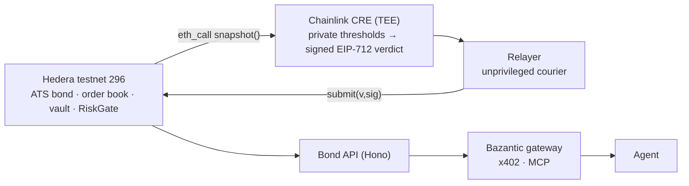
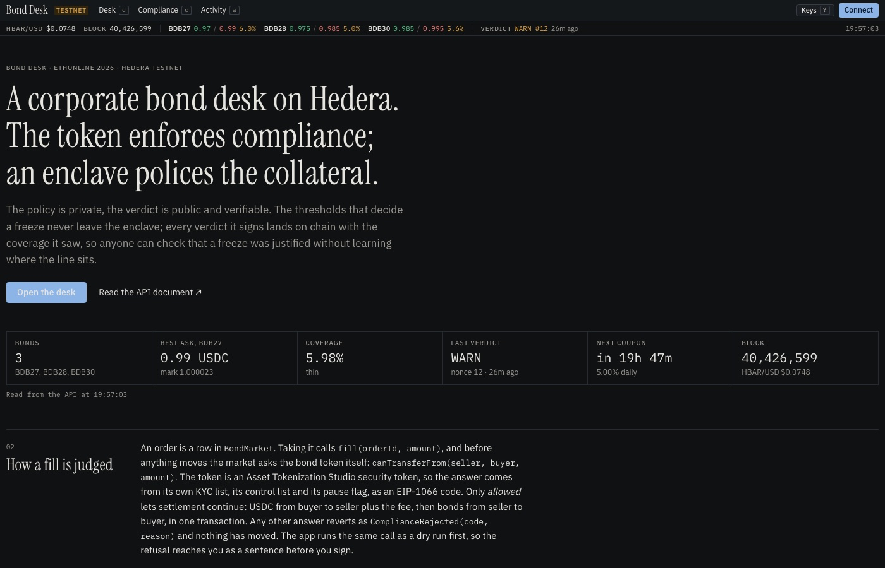
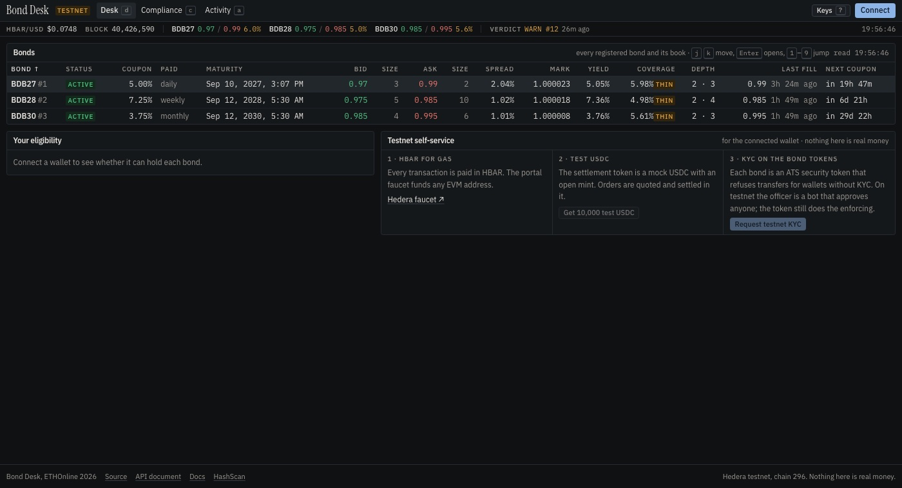
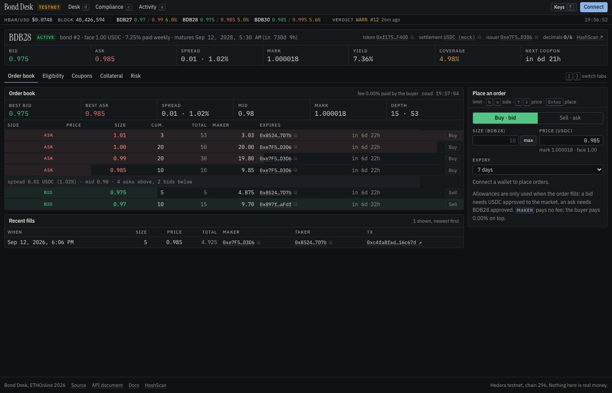
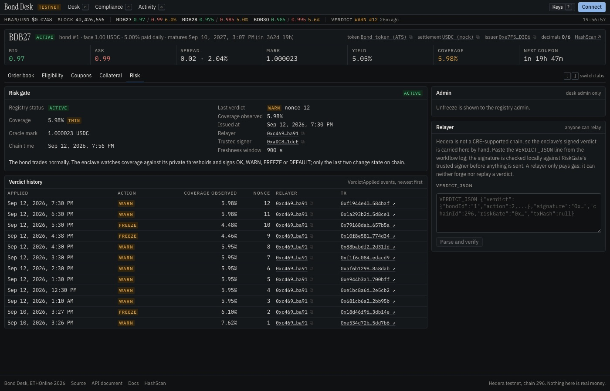

# Bond Desk: a compliant bond market on Hedera, policed from inside a TEE

A corporate bond issued through Hedera's Asset Tokenization Studio, traded on an order book that calls the
token's own compliance check before every fill, with coupons fired by Hedera's Schedule Service and collateral
valued against a live Chainlink HBAR/USD feed. A Chainlink CRE confidential workflow reads that collateral from
inside an enclave, decides against thresholds that never leave it, and signs an EIP-712 verdict that any
unprivileged relayer can land on-chain. The same market is exposed as a paid, agent-callable API through
Bazantic.

The property that ties it together: the policy is private, the verdict is public and verifiable. An observer can
check that a freeze was justified by the coverage the verdict carries, without learning where the thresholds
sit.

Built for ETHOnline 2026. Everything below ran on Hedera testnet (chain 296) on 2026-09-10.

## Live on testnet today

| Contract | Address | Source |
|---|---|---|
| BondRegistry | [`0x378F45197809358b10d4F4FaBc1F9AAD6bB9b53E`](https://hashscan.io/testnet/contract/0x378F45197809358b10d4F4FaBc1F9AAD6bB9b53E) | verified |
| NavOracle | [`0x56260E6CF630043421C1469Ee511E66c3eE95505`](https://hashscan.io/testnet/contract/0x56260E6CF630043421C1469Ee511E66c3eE95505) | verified |
| CollateralVault | [`0x82db4a2ba9859816D60E3d3CE2F6F1E29818FaF7`](https://hashscan.io/testnet/contract/0x82db4a2ba9859816D60E3d3CE2F6F1E29818FaF7) | verified |
| BondMarket | [`0x9e393461E165E9975A0A74f7FC378E6C342104B1`](https://hashscan.io/testnet/contract/0x9e393461E165E9975A0A74f7FC378E6C342104B1) | verified |
| BondLifecycle | [`0xeB363F5aEd5D2a94b41EBF0876bd36864255C956`](https://hashscan.io/testnet/contract/0xeB363F5aEd5D2a94b41EBF0876bd36864255C956) | verified |
| RiskGate | [`0x1dFF1d5458D6a6f6af46014de76474DC3170C31B`](https://hashscan.io/testnet/contract/0x1dFF1d5458D6a6f6af46014de76474DC3170C31B) | verified |
| MockUSDC (settlement) | [`0xF712daABfF190B34fd6C870761Ac4efa54E821B1`](https://hashscan.io/testnet/contract/0xF712daABfF190B34fd6C870761Ac4efa54E821B1) | verified |
| ATS bond token (bondId 1) | [`0x0100526434C821d0df24f6CC60352F830F8b4504`](https://hashscan.io/testnet/contract/0x0100526434C821d0df24f6CC60352F830F8b4504) | ATS factory proxy |
| ATS bond token (bondId 2, BDB28) | [`0xf175d5B0…c6F40D`](https://hashscan.io/testnet/contract/0xf175d5B081d8A5187Bdb5b7fA6F621eFe9c6F40D) | ATS factory proxy |
| ATS bond token (bondId 3, BDB30) | [`0xd6752FfC…5a983f`](https://hashscan.io/testnet/contract/0xd6752FfC596C8F9D4F5D530246e5698ec65a983f) | ATS factory proxy |

The seven contracts marked verified are source-verified on Sourcify (exact match) and show as verified on
HashScan; `contracts/script/verify.sh` reproduces it. The bond token is a resolver proxy deployed by the ATS
factory, so its source lives in the ATS repo, not here.

`BondLifecycle` was redeployed twice: once to raise `SCHEDULE_GAS` after the first scheduled coupon ran out of
gas on testnet (step 7 of the storyline), and once to add `SCHEDULE_LAG` after the second scheduled coupon fired
two seconds before its due second (step 13). The superseded instances are
`0x10E79b89Fd088935b8Ca86c697ff5c38050AcB1d` and `0x044eB54FcA9488356A06121e767cba552a1E5C1B`; both HBAR floats
were recovered and every consumer reads the address above from `deployments/testnet.json`.

| Item | Value |
|---|---|
| ATS factory (existing testnet deployment) | [`0xd1F118A40f3b02883D35909eF2517e7EDd78379d`](https://hashscan.io/testnet/contract/0xd1F118A40f3b02883D35909eF2517e7EDd78379d) |
| ATS BusinessLogicResolver | [`0xBA2D5FC2083A0b8f164c50e65d782087fBA18E0a`](https://hashscan.io/testnet/contract/0xBA2D5FC2083A0b8f164c50e65d782087fBA18E0a) |
| Chainlink HBAR/USD feed (8 dec) | [`0x59bC155EB6c6C415fE43255aF66EcF0523c92B4a`](https://hashscan.io/testnet/contract/0x59bC155EB6c6C415fE43255aF66EcF0523c92B4a) |
| Verdict signer (enclave key, never funded) | `0xaDC8997EfbE1925d07a002A2f31Bd3cE0e6F1dcE` |
| Coupon 1, HSS schedule that paid it | [`0.0.10457460`](https://hashscan.io/testnet/schedule/0.0.10457460) (EVM `0x…009F9174`, executed at `1789035662.019`) |
| Coupon 2, self-scheduled from inside coupon 1 | [`0.0.10457462`](https://hashscan.io/testnet/schedule/0.0.10457462) (EVM `0x…009F9176`, executed at `1789121682.025` and reverted `CouponNotDue`: block-timestamp lag, step 13) |
| Coupon 2, paid by hand on the lagged contract | [`0x5dc17671…4c22397f`](https://hashscan.io/testnet/transaction/0x5dc17671ed5ed779ff78c952ce312a053a1624f64aea39a7798c53544c22397f) (coupon id 1 on the new instance, `paidAt 1789154826`) |
| Coupon 3, self-scheduled with the lag | [`0.0.10482928`](https://hashscan.io/testnet/schedule/0.0.10482928) (EVM `0x…9fF4F0`, `expiration_time 1789208092` = target + 10; **executed at `1789208092.013`, child `CONTRACTCALL SUCCESS`**, coupon id 2 on the lagged contract: snapshot 3, 13,698 units, `paidAt 1789208091`) |
| Coupon 4, armed by coupon 3 from inside itself | EVM `0x…A031b5` = [`0.0.10498485`](https://hashscan.io/testnet/schedule/0.0.10498485), due 2026-09-13 10:14:52 UTC + 10 s |
| Bond 2 (BDB28) coupon 1, HSS schedule | [`0.0.10500672`](https://hashscan.io/testnet/schedule/0.0.10500672) (EVM `0x…A03a40`, `expiration_time 1789820091` = first coupon `1789820081` + 10, pending until 2026-09-19 12:14:51 UTC) |
| Bond 3 (BDB30) coupon 1, HSS schedule | [`0.0.10501036`](https://hashscan.io/testnet/schedule/0.0.10501036) (EVM `0x…A03baC`, `expiration_time 1791808395` = first coupon `1791808385` + 10, pending until 2026-10-12 12:33:15 UTC) |
| Chainlink CRE workflows (private registry, deployed 2026-09-12) | `liquidation-protection-production` `00cdbaa2…48554f` (30 s), `bond-monitor-production` `0045bd36…5c96c8` (hourly, direct delivery); [`docs/cre-evidence/deployed-20260912.txt`](docs/cre-evidence/deployed-20260912.txt) |
| First FREEZE delivered by the deployed monitor, from the CRE network | [`0x79168dab…657b5a`](https://hashscan.io/testnet/transaction/0x79168dab6bc406a757a4c7aa76039f94da662512430ec9cae4e6611ad6657b5a) (execution `3b141694…d719`, 2026-09-12 12:00:01–12:00:09 UTC; `VerdictApplied(1, FREEZE, 448, nonce 10)` and Active → Frozen in one transaction) |
| First verdict delivered by the deployed monitor, from the CRE network | [`0xe1bc8a6d…2e5cb2`](https://hashscan.io/testnet/transaction/0xe1bc8a6d205c62d0d0123a91a77100dcb8da5a77810fbbe0e85de4de5f2e5cb2) (execution `b20c80c2…92fa`, 2026-09-12 07:00:02–07:00:12 UTC; `VerdictApplied(1, WARN, 595, nonce 4)`, sent by the enclave's own submit key, 58,086 gas) |
| Chainlink liquidation challenge, `join()` on Sepolia | [`0x22feaf45d88d5ffada8b10a55a4561e605326218d592d26d81e52e1977fe64a9`](https://sepolia.etherscan.io/tx/0x22feaf45d88d5ffada8b10a55a4561e605326218d592d26d81e52e1977fe64a9) |
| Bond Desk app + API (AWS App Runner, `ap-south-1`) | [`https://wd6nrvmajt.ap-south-1.awsapprunner.com`](https://wd6nrvmajt.ap-south-1.awsapprunner.com) — the app in a browser; `/healthz`, `/openapi.json` and the JSON routes for everything else |
| Bazantic gateway (LIVE) | `https://axuvor5zujgk5hdcydzjdi742m.bazgateway.com`, MCP at `/mcp` — unpaid `GET /bonds` returns 402 with an x402 challenge |
| Bazantic Recipe (published) | [Best Eligible Hedera Bond Recommendation](https://bazantic.com/recipes/best-eligible-hedera-bond-recommendation) — chains the mirror-node gateway `https://txrkgk2mezhbln4aeo2tdji6s4.bazgateway.com` with the Bond Desk gateway |

Machine-readable source of truth: [`deployments/testnet.json`](deployments/testnet.json) and
[`ats/testnet.json`](ats/testnet.json).

## Architecture

Full diagrams (system flowchart, verdict sequence) in [`docs/architecture.md`](docs/architecture.md).



## The storyline, with receipts

Every beat below is a transaction on Hedera testnet or a read against it, in narrative order. Read-only beats
are `cast call` reads, so they print a revert reason without spending gas.

1. **Issuance through the live ATS factory.** `deployBond` on the factory already deployed on testnet, no fork
   and no ATS redeploy:
   [`0xf12ba21d…bcf173`](https://hashscan.io/testnet/transaction/0xf12ba21df080b14138f1a48adc31bb777ed192278d71f87ae98c021212bcf173).
   Source: [`ats/script/CreateBond.s.sol`](ats/script/CreateBond.s.sol).
2. **KYC, in the order ATS enforces.** `addIssuer(issuer)`
   [`0x08bde15a…2040d6`](https://hashscan.io/testnet/transaction/0x08bde15a0ffad60a406bc5ad5c3b3ddfb6936c5460bf0ba6b09d2209122040d6),
   then `grantKyc` for the issuer
   [`0x6a438b61…d748c66`](https://hashscan.io/testnet/transaction/0x6a438b61fa6aca3666917ad9bba0eb9b1e927e358f264bfd67dd2d348d748c66)
   and two investors
   [`0x57bf1df6…d30b99`](https://hashscan.io/testnet/transaction/0x57bf1df6f0532272898a1d6932657c117234050e31fcfa7579edd86453d30b99),
   [`0x3fcb17d8…1234ec`](https://hashscan.io/testnet/transaction/0x3fcb17d88be8221323fd937d88cd4423f473e3653747caeef8dc1f4fa21234ec),
   then `mint(issuer, 100)`
   [`0xf6ed0aa4…931b7a`](https://hashscan.io/testnet/transaction/0xf6ed0aa4d158b8b32e11f250470c11ba8d96181e92ce1bf9dd44ce30fe931b7a).
   A third wallet (`0x3b44299d9F246dc775DC2e4A0B54e31DB5b31cb3`) is deliberately left without KYC.
3. **Issuer posts an ask.** Order 1, 20 bonds at 0.99 USDC, 7-day expiry:
   [`0x0e44ff6e…f90bf2ba`](https://hashscan.io/testnet/transaction/0x0e44ff6eef3aaf178d164f196572222e7b91622cf479e222ba48f64ff90bf2ba).
4. **The non-KYC wallet cannot fill it.** `BondMarket.fill` calls the token's own
   `canTransferFrom(seller, buyer, amount, "")` before it moves anything. Against live chain state it returns
   `(false, 0x10, InvalidKycStatus)` (reason selector `0xfc855b1b`) and the fill reverts
   `ComplianceRejected(0x10, 0xfc855b1b)`, selector `0x5afab9b8`:

   ```sh
   cast call 0x9e393461E165E9975A0A74f7FC378E6C342104B1 'fill(uint256,uint128)' 1 10 \
     --from 0x3b44299d9F246dc775DC2e4A0B54e31DB5b31cb3 --rpc-url hedera
   ```

5. **The KYC'd wallet fills the same order.** Investor 1 takes 10 of order 1:
   [`0x07e85a43…067bd4`](https://hashscan.io/testnet/transaction/0x07e85a43f2528f87172d71beaf61f60d8f0552859d01b29bf7536dbb7d067bd4).
   Same order, same block height range, different wallet.
6. **100 HBAR of collateral, 762 bps of coverage.** `CollateralVault.deposit{value: 100 ether}(1)`
   [`0xe80415c2…0cab4acd`](https://hashscan.io/testnet/transaction/0xe80415c206375cbe2580ce4c4bf415de7782ecb1b20dc2398224e5de0cab4acd).
   The relay divides the 18-decimal value by 1e10, so the chain stores 1e10 tinybar. `coverageBps` is computed
   on-chain from `latestRoundData()` on the HBAR/USD feed, and read back as **762**.
7. **A coupon the Hedera Schedule Service paid by itself, on the second attempt.** This is the beat that took a
   redeploy, so it is worth reading in order. The redeploy and the working coupon were run last, after step 12,
   which is why their timestamps (`1789035282`, `1789035662`) sit after the relay transactions in steps 8 and 10
   (`issuedAt` `1789034121` and `1789034272`) and after the unfreeze.

   The first schedule was created at deploy time via HIP-1215 `scheduleCall` on the `0x16b` system contract
   ([`0x78dddb6a…a581686`](https://hashscan.io/testnet/transaction/0x78dddb6ab8bba5c4111ecbcbd31347b76e81091705849fcf985730f05a581686)),
   producing entity [`0.0.10456917`](https://hashscan.io/testnet/schedule/0.0.10456917). It **executed** on time
   (`executed_timestamp: 1789035282.045`) and the `payCoupon` inside it **reverted**:
   `CONTRACT_REVERT_EXECUTED`, out of gas. `SCHEDULE_GAS` was 2,000,000, but `payCoupon` against the real ATS
   token plus the nested re-schedule estimates at roughly 1.84M and the system contract adds a markup on top.
   Commit `ae952c9` raises `SCHEDULE_GAS` to 4,000,000 (`hasScheduleCapacity` accepts at least 12M on testnet)
   and `BondLifecycle` was redeployed to `0x044eB54F…2a1E5C1B`, re-granted `GATE_ROLE`
   ([`0x065398ec…f45d21d8`](https://hashscan.io/testnet/transaction/0x065398eca7c5e17f97bad3556fd23dca0c77cbc23443923bccea9ebaf45d21d8)),
   `ROLE_SNAPSHOT`
   ([`0x24086604…de799c2d`](https://hashscan.io/testnet/transaction/0x24086604c363ebffef154f6725bbeafb929068c63011f8c05e425cd6de799c2d))
   and `ROLE_MATURITY_REDEEMER`
   ([`0x8b812fdf…bc6558e1`](https://hashscan.io/testnet/transaction/0x8b812fdf76655b07a552df97a092658ec85b4be739b81b94b46cfbaebc6558e1)),
   with the old instance's HBAR float recovered
   ([`0x429e197f…cc388187`](https://hashscan.io/testnet/transaction/0x429e197ffd89fe7d5acd41d76b793142d91756230d26a30cdecd6360cc388187))
   and 20 HBAR put into the new one, which is the HSS payer
   ([`0x5f3238f0…7ca5c96d`](https://hashscan.io/testnet/transaction/0x5f3238f076e5910db073561ec0fd4318d9091efc8e22fb2601db847d7ca5c96d)).

   Then the coupon was funded with 100 USDC (approve
   [`0xd0542981…e78f8bad`](https://hashscan.io/testnet/transaction/0xd05429815d1bd94617c42ce93e26132adc1a1928de21334902f11282e78f8bad),
   `fund(1, 100e6)`
   [`0xa85bd3a8…bb2a4401`](https://hashscan.io/testnet/transaction/0xa85bd3a8330adcfa61f206fb695b828bd51c15f492793a7df5c93334bb2a4401))
   and rescheduled for five seconds out (`schedule(1)`
   [`0xe00bea9a…4962bc95`](https://hashscan.io/testnet/transaction/0xe00bea9a4f2b58f807329545b4d147a83f97771992e2977f8a8e88044962bc95),
   gas used 1,505,270, so it needs `--gas-limit 3000000`; a 600k limit reverts), producing entity
   [`0.0.10457460`](https://hashscan.io/testnet/schedule/0.0.10457460).

   **The Schedule Service executed it at `1789035662.019`, with no bot and no keeper**, and this time the
   coupon paid: `couponCount(1)` is 1 and coupon 1 is `{snapshotId 1, amount 13698, paidAt 1789035661}`. 13,698
   USDC base units is 100 tokens at 1 USDC face, 5% a year, for one day. Claims are pull-based over the ATS
   snapshot, so investor 1, holding 10 of the 100 bonds, claimed 1,369 units
   ([`0x5c6130d9…9d97920d`](https://hashscan.io/testnet/transaction/0x5c6130d98de6a60240394f5b5731afcca43400ac1ca7fc7ab2b315b59d97920d));
   the issuer's remaining claimable is 12,328.

   **The executed call also scheduled the next coupon from inside itself**, with no
   `NO_SCHEDULING_ALLOWED_AFTER_SCHEDULED_RECURSION`: entity
   [`0.0.10457462`](https://hashscan.io/testnet/schedule/0.0.10457462), due `1789121682`. That is the coupon's
   target second `1789035282` plus one 86,400-second interval: `payCoupon` advances `nextCoupon` by
   `couponInterval` from the second the coupon was *due*, not from the second the Schedule Service happened to
   execute it (`1789035662`). That is the self-scheduling timer, proved end to end. The mirror node is the
   authoritative record, not the `SUCCESS` response code from `scheduleCall`, and
   `harness/scripts/validate-schedule.sh 0x00000000000000000000000000000000009F9174` exits 0 against it.
8. **The enclave says WARN.** `cre workflow simulate bond-monitor` reads `RiskGate.snapshot(1)` over JSON-RPC
   from inside the TEE handler, decides against private thresholds, signs, and prints
   `coverage=<100% action=WARN reason=below-warn nonce=1` plus a `VERDICT_JSON` line carrying
   `coverageObserved: 762`. Log:
   [`docs/cre-evidence/bond-monitor-20260910-1527-warn.log`](docs/cre-evidence/bond-monitor-20260910-1527-warn.log).
   The relayer verified the signature locally, then submitted it:
   [`0xe534d72b…c6e085dd7b6`](https://hashscan.io/testnet/transaction/0xe534d72b2f9ec132756dc66b63e1476b05a50d13f8613b69a327ac6e085dd7b6).
9. **Collateral withdrawn, coverage falls to 610 bps.** 20 HBAR out of the vault:
   [`0xc72335c7…99fd0051`](https://hashscan.io/testnet/transaction/0xc72335c792f9dbb91ea980746ea56770925d7a51fff7ff805a56612299fd0051).
   The first attempt reverted because the relay's `eth_estimateGas` under-estimates a contract that sends native
   HBAR; the successful call passes `--gas-limit 400000` explicitly.
10. **The enclave says FREEZE.** Same commit, same chain, same code path, lower coverage:
    `action=FREEZE reason=below-freeze nonce=2`, `coverageObserved: 610`. Log:
    [`docs/cre-evidence/bond-monitor-20260910-1533-freeze.log`](docs/cre-evidence/bond-monitor-20260910-1533-freeze.log).
    Relayed:
    [`0x18d46f96…573db14e`](https://hashscan.io/testnet/transaction/0x18d46f9627d0e7808d2c78d73848c5aefd813d73147bd19abc74c8e0573db14e).
    `RiskGate` recovered the signer, checked that the nonce had increased, and set the registry status to `Frozen`.
11. **A KYC'd buyer with a valid order now cannot fill either.** Same `cast call` as step 4, from investor 1,
    reverts `BondNotActive` (selector `0x34823ce5`). Compliance and risk are separate gates and both are in the
    contract:

    ```sh
    cast call 0x9e393461E165E9975A0A74f7FC378E6C342104B1 'fill(uint256,uint128)' 1 5 \
      --from 0x897f8b6F2876d61E661889b578F4435E406baFdf --rpc-url hedera
    ```

    Only reproducible while the bond is `Frozen`. Step 12 unfroze it, so re-run today the call succeeds; relay a
    FREEZE verdict again ([`docs/cre-evidence/README.md`](docs/cre-evidence/README.md)) to reproduce the revert.

12. **Unfreezing is an admin action, not a verdict.** `RiskGate.unfreeze(1)`
    [`0x00915e79…6bd8b10c`](https://hashscan.io/testnet/transaction/0x00915e79ecb638a2713c5f4de923aea26c96b89bdc8994d8eac6a49b6bd8b10c).
    The gate only accepts enclave-signed verdicts, so it has no "clear" verdict; the bond keeps its last FREEZE
    as history and consumers must gate on `status`. `GET /bonds/1/risk` shows exactly that at the time of writing
    (2026-09-10): `status` `Active`, `lastNonce` 2, and `lastVerdict` still FREEZE at nonce 2. `coverageBps` read
    610 then; it is computed on-chain from the HBAR/USD feed and moves with it, so a fresh read will differ.

Nonce 1 to nonce 2 across steps 8 and 10 is the replay guard doing its job: the nonce comes from the same
snapshot the decision used, so a resubmitted verdict is rejected.

13. **Coupon 2 and the block-timestamp lag.** The schedule coupon 1 armed from inside itself, [`0.0.10457462`](https://hashscan.io/testnet/schedule/0.0.10457462), executed exactly when asked (`executed_timestamp 1789121682.025`) and the `payCoupon` inside it reverted `CouponNotDue`. It landed in block `40378969`, whose window starts at `1789121680.007`: `block.timestamp` is the block's start, two seconds before the expiry second, and `nextCoupon` was `1789121682`. Coupon 1 had only passed because it was re-armed at `now + 5` with its target already in the past. The fix is `SCHEDULE_LAG = 10`: a coupon due at `T` is armed at `T + 10`, and `harness/src/HederaTest.sol::executeLagged` reproduces the gap in the unit tests. `BondLifecycle` was redeployed to `0xeB363F5a…4255C956` ([`0x6e8c94ae…9fb3ff52`](https://hashscan.io/testnet/transaction/0x6e8c94aea4b8616ea86cf497d7ead9ecbecf875c320b5fe445566c199fb3ff52)), re-granted `GATE_ROLE` ([`0x04ea2ac5…2b822717`](https://hashscan.io/testnet/transaction/0x04ea2ac54e14d224ff6fa86383eddbd12b58d3034c01391e384d96b02b822717)), `ROLE_SNAPSHOT` ([`0xe7e6bcfb…17d179f1`](https://hashscan.io/testnet/transaction/0xe7e6bcfb1e88a77500c7f0c18080d2b6abf6ff6fc859e2a6e2a547ff17d179f1)) and `ROLE_MATURITY_REDEEMER` ([`0xa9064f8e…f378a0b8`](https://hashscan.io/testnet/transaction/0xa9064f8e374735ac74a46731e2ee5600cd3927ee9e1cee6ec94690dff378a0b8)), the old float of 18.02 HBAR recovered ([`0x583bd526…df1fd585`](https://hashscan.io/testnet/transaction/0x583bd52687c8eb84d81330424b809217b91a5f811f382a52ebd65636df1fd585)), 20 HBAR put into the new payer ([`0x125df0b9…4c328b5`](https://hashscan.io/testnet/transaction/0x125df0b9c556243a7a108590a5d9504291f43257bc1cf1fc2f57768fb4c328b5)) and the pool funded with 110 USDC, coupons through maturity plus principal ([`0x68d43f18…5e98f7`](https://hashscan.io/testnet/transaction/0x68d43f1844391b0d05cd37af641ee8ae5cb56209e7dcc5d1aaff83550f5e98f7), [`0x7352736c…84e2eb4`](https://hashscan.io/testnet/transaction/0x7352736c3291b1a2b2276fcdd4e734c5ef59ca4e252b04182d2cea77e84e2eb4)). Investor 2 first took 5 of the issuer's open ask ([`0xe0979416…7b1b9d3`](https://hashscan.io/testnet/transaction/0xe0979416a9cf0e9846400908ada8c88815bbe53bd05a01ce7bf6772ff7b1b9d3)), then coupon 2 was paid by hand, `payCoupon(1)` at a 4M gas limit ([`0x5dc17671…4c22397f`](https://hashscan.io/testnet/transaction/0x5dc17671ed5ed779ff78c952ce312a053a1624f64aea39a7798c53544c22397f), 1,678,160 gas): 13,698 units over snapshot 2, and it armed coupon 3 as [`0.0.10482928`](https://hashscan.io/testnet/schedule/0.0.10482928) with `expiration_time 1789208092`, the target plus the lag. Investor 2 claimed 684 units for its 5 of 100 bonds ([`0x2baa19e5…6900c6d`](https://hashscan.io/testnet/transaction/0x2baa19e599259dad04ffb600e89254e654e10b11066c73c0ea83c13066900c6d)). `harness/scripts/validate-schedule.sh "$(jq -r .schedule deployments/testnet.json)"` reports `pending` until 2026-09-12 10:14:52 UTC.
14. **Compliance is the token's, not ours.** The compliance officer froze investor 2 on the ATS token, `setAddressFrozen(inv2, true)` ([`0x9e5b7921…d329fad9`](https://hashscan.io/testnet/transaction/0x9e5b7921fb15e1891a63926e6104a64582ed0b66a792a71656b32626d329fad9)); `canTransferFrom(issuer, inv2, 1, "")` then returned `(false, 0x10, AccountIsBlocked)` (reason selector `0x796c1f0d`), the same read `BondMarket.fill` makes, and after the unfreeze ([`0x4ce0414d…378b868`](https://hashscan.io/testnet/transaction/0x4ce0414d87015704883c0da692e26b94fa189055e94ab65aea03804be378b868)) it returns `(true, 0x01, 0x0)`. The first unfreeze attempt reverted out of gas at the relay's estimate, taken against a state that did not yet include the freeze; the retry passes `--gas-limit 300000`.
15. **The harness, run on itself.** `DeployTemplate.s.sol` broadcast: `PingWithHarness` [`0x0F14C057…B054FBE`](https://hashscan.io/testnet/contract/0x0F14C057F7912651254f9A4c61778033CB054FBE) (Sourcify exact match), schedule [`0.0.10482965`](https://hashscan.io/testnet/schedule/0.0.10482965) executed at `1789155023.095` and `validate-schedule.sh` exited 0. Its `Pinged` log reads `1789155022`, one second before the expiry second: the lag, live, a third time. Full output in [`harness/README.md`](harness/README.md#receipts).

16. **The enclave on the network delivers a verdict by itself.** At 07:00:02 UTC on 2026-09-12 the deployed
    `bond-monitor-production` workflow ran on the CRE network for the first time (execution `b20c80c2…92fa`,
    `SUCCESS`, 10 s): it read `RiskGate.snapshot(1)` over JSON-RPC, decided WARN against the private thresholds,
    signed the EIP-712 verdict with the enclave-held key, and, in `direct` mode, signed and sent the Hedera
    transaction itself from the submit key: [`0xe1bc8a6d…2e5cb2`](https://hashscan.io/testnet/transaction/0xe1bc8a6d205c62d0d0123a91a77100dcb8da5a77810fbbe0e85de4de5f2e5cb2)
    (`VerdictApplied(bondId 1, WARN, coverageObserved 595, nonce 4, relayer 0xc469…ba91)`, block 40414052,
    58,086 gas). No simulator, no relayer, no human. It repeats every hour; the nonce on RiskGate and the verdict
    history in the app's Risk tab are the running record.

17. **Coupon 3 fires by itself, with the lag.** At `1789208092.013` (2026-09-12 10:14:52 UTC, the target second
    plus the ten-second lag) the Schedule Service executed [`0.0.10482928`](https://hashscan.io/testnet/schedule/0.0.10482928);
    this time the child transaction is `CONTRACTCALL SUCCESS`: `payCoupon` ran inside it, took snapshot 3, set
    aside 13,698 units as coupon id 2 on the lagged contract (`paidAt 1789208091`), and armed coupon 4 as
    [`0.0.10498485`](https://hashscan.io/testnet/schedule/0.0.10498485) for the same second tomorrow plus the lag.
    `harness/scripts/validate-schedule.sh 0.0.10482928` exits 0 on the executed-and-succeeded check. Nobody sent
    a transaction: the timer wound itself, and this time the fix from step 13 held.

18. **The same storyline, driven from the app (2026-09-12, 10:57–11:23 UTC).** Every beat below was clicked in
    the app on `localhost:5173?burners=1` (dev mode, demo keys, no wallet extension) against the live testnet, and
    every transaction is in the app's **Activity** page with its HashScan link.
    - Investor 3, no KYC, connects: the Desk shows **NOT ELIGIBLE** with the reason. It tries to buy 2 bonds from
      the issuer's ask: the app simulates first and shows *The token refused this transfer: KYC status invalid
      (code 0x10, disallowed)*; nothing was signed.
    - Investor 3 presses *Request testnet KYC*, signs a one-line message, and the API's officer bot grants KYC on
      the token ([`0x6ce3d667…562943`](https://hashscan.io/testnet/transaction/0x6ce3d667562943)); the standing
      panel flips to **KYC GRANTED** without a reload.
    - The same wallet buys 2 bonds at 0.99: [`0x6e478f70…d0d3f0`](https://hashscan.io/testnet/transaction/0x6e478f708e1c58cb3a97c76f8d53174df0c70bebada44dc84de0bd5698d0d3f0);
      the ask shrinks to 2 and the trade appears in the fills table.
    - The issuer withdraws 20 HBAR ([`0xea779b76…dc2b7c`](https://hashscan.io/testnet/transaction/0xea779b76a91d961617d3ae00d29491b394f31e7518429d4b779c79a4e1dc2b7c));
      coverage drops from 5.95% to 4.46%. The simulator (`bun run sim:bond`, log
      `docs/cre-evidence/bond-monitor-20260912-1634-freeze.log`) now signs **FREEZE** at nonce 9.
    - The relayer wallet pastes the `VERDICT_JSON` line into the Risk tab: *signature valid for 0xaDC8…*,
      nonce 9 above the last applied 8, then submits: [`0x10f8e581…774d34`](https://hashscan.io/testnet/transaction/0x10f8e581774d34)
      at 11:08:46 UTC. The registry goes **FROZEN**; the same line pasted again is refused by the app as
      *nonce 9 is not above the last applied nonce 9*.
    - Investor 1, KYC'd and holding 11 bonds, cannot buy: the order book is greyed out with *the market rejects
      new orders (BondNotActive)*, and the contract agrees, `fill(1,1)` from that wallet reverts with
      `0x34823ce5` = `BondNotActive(1, Frozen)`.
    - The issuer, who is the desk admin, presses *Unfreeze*: [`0x2531b7e7…bf9d93`](https://hashscan.io/testnet/transaction/0x2531b7e79267272bdf01410b522ba09e8397c5a8a7013b669ca48ee6c3bf9d93).
      Status **ACTIVE**, coverage still 4.46%: the app says so, and the deployed monitor will say so too at the
      next hour (step 19).
    - Investor 1 claims its share of coupon 2, 0.001506 USDC for 11 of 100 bonds at snapshot 3:
      [`0x9016e15e…e59fbd`](https://hashscan.io/testnet/transaction/0x9016e15ee59fbd).
    - The compliance officer looks investor 3 up, freezes it on the token
      ([`0x9a5f6677…0d022d`](https://hashscan.io/testnet/transaction/0x9a5f66770d022d)), the token's own probe
      answers `AccountIsBlocked` (code 0x10), unfreezes it
      ([`0xc9d2ad6c…9bff25`](https://hashscan.io/testnet/transaction/0xc9d2ad6c9bff25)) and finally revokes its
      KYC ([`0x1811e69d…6ce1d1`](https://hashscan.io/testnet/transaction/0x1811e69d6ce1d1)), so the demo starts
      again from a wallet without KYC.

    Two things the walkthrough taught us, both fixed the same hour: on this ATS build `setAddressFrozen`
    puts the account on the *control list* (`isInControlList` is the getter; `isFrozen` stays false), and
    Hedera's `eth_call` does not impersonate a contract as `from`, so a read-only `canTransferFrom` can never be
    asked "as the market": the app now says that instead of quoting the allowance code as a refusal.

19. **The deployed enclave freezes the market by itself.** With the 20 HBAR still out after step 18 (coverage
    4.48%), the hourly network run at 12:00:01 UTC on 2026-09-12 (execution `3b141694…d719`, `SUCCESS`, 8 s)
    decided FREEZE against its private thresholds, signed the verdict in the enclave and delivered it from its own
    key: [`0x79168dab…657b5a`](https://hashscan.io/testnet/transaction/0x79168dab6bc406a757a4c7aa76039f94da662512430ec9cae4e6611ad6657b5a) carries `VerdictApplied(bondId 1,
    FREEZE, coverageObserved 448, nonce 10)` and, in the same transaction, the registry's Active → Frozen. No
    simulator, no relayer, no human: the same policy that WARNed every hour since 07:00 halted trading the hour
    coverage was below its line. The issuer then restored coverage ([`0x28af8eaa…5d7e0a`](https://hashscan.io/testnet/transaction/0x28af8eaad0bc7698152895702c20e9620be6aad5428de04ceb080d80185d7e0a),
    20 HBAR back, 5.98%) and the admin unfroze ([`0xc71d7edf…52ca66`](https://hashscan.io/testnet/transaction/0xc71d7edf40e01341e5c9895cc29b41d647e36bfc18304d24b092f5732652ca66)).

20. **Two more bonds, three live books (2026-09-12, 12:13–12:41 UTC).** The desk had one book with one ask; it now
    has three. Two more bonds went through the same live ATS factory with the same script, generalised:
    `forge script ats/script/CreateBond.s.sol:CreateBond --sig "create(string,string,string,uint256,uint256)" <name> <symbol> <isin> <supply> <maturity>`
    builds the same `deployBond` call as bond 1 (Reg S, internal KYC, the nine-role `Rbac` list,
    `BondDetailsData("USD", 1, 0, start, maturity)`), grants KYC to the issuer and investors 1 and 2 only, mints the
    supply to the issuer and appends the token to `bonds` in [`ats/testnet.json`](ats/testnet.json). Both ISINs pass
    the factory's Luhn check. Every hash below is also in [`docs/seed-20260912.json`](docs/seed-20260912.json).
    - **Bond 2, "Bond Desk 7.25% 2028" (BDB28)**, ISIN `XS2028091200`, 60 bonds at 1 USDC face, 725 bps paid weekly
      (`couponInterval 604800`), maturity `1852329600` (2028-09-12): token [`0xf175d5B0…c6F40D`](https://hashscan.io/testnet/contract/0xf175d5B081d8A5187Bdb5b7fA6F621eFe9c6F40D).
      `deployBond` [`0xa7095a24…8036d3`](https://hashscan.io/testnet/transaction/0xa7095a24565eb49d9250dc2d02f9427e4f9f59c4e9dbe5083cd7296abb8036d3), `addIssuer` [`0xaa86aa5e…9388c9`](https://hashscan.io/testnet/transaction/0xaa86aa5ec3cf0920dba0d9e00df6900b328cf65a6d293ea70c645c194f9388c9), `grantKyc` for the issuer
      [`0x11862c0b…034b83`](https://hashscan.io/testnet/transaction/0x11862c0b884cd6e609a2af6722ad7bb37d93d730bf9383a8f9653139e5034b83), investor 1 [`0xb1ceb7a6…cfedc2`](https://hashscan.io/testnet/transaction/0xb1ceb7a696b0b49e178b138b76651c742ae1c2eccadc705b819736a430cfedc2) and investor 2 [`0x413d6f55…808d94`](https://hashscan.io/testnet/transaction/0x413d6f55023f560aabbb99436448e6311690377be8a95d1fd1ab4d8cbd808d94),
      `mint(issuer, 60)` [`0x9721561f…a7cf6e`](https://hashscan.io/testnet/transaction/0x9721561f271d9d0163657eac8e32a0c18f553149ac22b96e83d554a55fa7cf6e). `ROLE_SNAPSHOT` to the lifecycle [`0xc1289537…86d1d6`](https://hashscan.io/testnet/transaction/0xc12895374d902fca25461689dc6e2644fbdc521cfcd68cbe538f54ba3786d1d6) and
      the vault [`0x1a847713…6e1ff7`](https://hashscan.io/testnet/transaction/0x1a8477135cf36199f4d873e0e9edd1c67aae1155f17107e288b3cb26666e1ff7), `ROLE_MATURITY_REDEEMER` to the lifecycle
      [`0x4ecb9e03…6de1ce`](https://hashscan.io/testnet/transaction/0x4ecb9e03ab5ba602d09f2e43335f49ca8bcde786ca22dd8a2febb936636de1ce); `register` [`0x32591c86…f892b3`](https://hashscan.io/testnet/transaction/0x32591c86e1a256b9ddf07d214f827df3639e2931e9ec1fa9552f158eaff892b3) (bondId 2, first coupon
      `1789820081` = registration plus one interval); 40 HBAR of collateral [`0xb464624d…c368e5`](https://hashscan.io/testnet/transaction/0xb464624de8e430704cded582190be77213e541c185354b9b833fac1611c368e5)
      (coverage **498 bps**); `fund(2, 15 USDC)` [`0x67434650…b74e2b`](https://hashscan.io/testnet/transaction/0x674346501156cbbadc462ae938a87244fb98baa3d5b35ab5a4903a3801b74e2b); `schedule(2)` [`0x3e2cecce…4b6076`](https://hashscan.io/testnet/transaction/0x3e2ceccea58a6f2f78a55305fa5bb2a72173e318ff137bf457ba42a3754b6076) (1,505,292 gas)
      created HSS schedule [`0.0.10500672`](https://hashscan.io/testnet/schedule/0.0.10500672) (EVM `0x…A03a40`, `expiration_time 1789820091`
      = target + 10 s, `executed_timestamp null`).
    - **Bond 3, "Bond Desk 3.75% 2030" (BDB30)**, ISIN `XS2030091206`, 40 bonds at 1 USDC face, 375 bps every 30 days
      (`couponInterval 2592000`), maturity `1915401600` (2030-09-12): token [`0xd6752FfC…5a983f`](https://hashscan.io/testnet/contract/0xd6752FfC596C8F9D4F5D530246e5698ec65a983f).
      `deployBond` [`0x5fa1d505…89b273`](https://hashscan.io/testnet/transaction/0x5fa1d505b1baf0c09d080aaff8652447438a1795addba54ea72e11341389b273), `addIssuer` [`0x99c3b07b…d6bc4c`](https://hashscan.io/testnet/transaction/0x99c3b07b7d3a65299e15f6c31005a85a993acd935bc144fac4e14e6095d6bc4c), `grantKyc` for the issuer
      [`0x7010cfa7…624ce0`](https://hashscan.io/testnet/transaction/0x7010cfa74e7f538cb4b5816d979dca6d0235ec4070079f4714b1333d2a624ce0), investor 1 [`0xa653917a…4ac31b`](https://hashscan.io/testnet/transaction/0xa653917aae08dd9d340c5881a3ca89bb6c2abd3e24ceb511d90f384cbc4ac31b) and investor 2 [`0x448fb08f…954316`](https://hashscan.io/testnet/transaction/0x448fb08fb11765acca1ffb23c72e7d2fcf6fa3d27fbc8bb1bf64c56cc9954316),
      `mint(issuer, 40)` [`0xeb821815…0d995e`](https://hashscan.io/testnet/transaction/0xeb82181530ea2a891274c0aebf44828a65ba0be2f9c03afcbeadc2cacc0d995e). `ROLE_SNAPSHOT` to the lifecycle [`0x87838916…a5ff6d`](https://hashscan.io/testnet/transaction/0x87838916bbec11dd2ec5d46c13a6856c68b7d999130dbfa794992e30b2a5ff6d) and
      the vault [`0x49606e71…3bacf5`](https://hashscan.io/testnet/transaction/0x49606e71ef01351342e25715a5f88bb328e72a45316d001652f8f71ed03bacf5), `ROLE_MATURITY_REDEEMER` to the lifecycle
      [`0xe30ed152…1bd400`](https://hashscan.io/testnet/transaction/0xe30ed152823dd16911f1ccf2a7c68b97dbc0306aa222f5574e8dc08aff1bd400); `register` [`0x67726b77…d59084`](https://hashscan.io/testnet/transaction/0x67726b77ff52d8061ffea9651803a96ffd456a3a3215b3bc49de22cefed59084) (bondId 3, first coupon
      `1791808385`); 30 HBAR of collateral [`0x25afe204…32ac1b`](https://hashscan.io/testnet/transaction/0x25afe204e082687593a4d91f990e9a76774e64d1a248591072672950e232ac1b) (coverage **561 bps**);
      `fund(3, 10 USDC)` [`0x24f0d7ef…9432aa`](https://hashscan.io/testnet/transaction/0x24f0d7ef6739c6bca72212991c864f2a755807177e46124953e3773d749432aa); `schedule(3)` [`0x82b8745d…318829`](https://hashscan.io/testnet/transaction/0x82b8745d598d707b98909c4b2afba738c387f05796bd0d6106982f51a0318829) created [`0.0.10501036`](https://hashscan.io/testnet/schedule/0.0.10501036)
      (EVM `0x…A03baC`, `expiration_time 1791808395`, pending).
    - Gas money first: 120 HBAR to the issuer [`0xc5f2f8dd…0c2970`](https://hashscan.io/testnet/transaction/0xc5f2f8dd138cc092359a21eb222a43013aba8000115aed0981c8bafbf10c2970), 12 HBAR each to investor 1
      [`0x8bb3235d…2ec94b`](https://hashscan.io/testnet/transaction/0x8bb3235d8470d20ed4ccdc5bc28bef03440afcbb82d2e3787831a786262ec94b) and investor 2 [`0x1eb5991b…f668a3`](https://hashscan.io/testnet/transaction/0x1eb5991b5b95cd2c4965c0c266a5cf60488cb0a3e9b78f9744107b6c7ef668a3) from the funding account. Both
      investors already held about 1,000,000 mock USDC, so nothing was minted. Allowances raised to max where they
      were not already: issuer USDC→lifecycle [`0x9ec2ee9f…302ce4`](https://hashscan.io/testnet/transaction/0x9ec2ee9f005fadb7dcec4796e94016d1e0c000d758db751bfcbca356bf302ce4), USDC→market
      [`0xf910af48…ca3714`](https://hashscan.io/testnet/transaction/0xf910af482fbd9dfff526cc9b9203e07fb82444c840afae0e29bb1b356eca3714), BDB28→market [`0x3292ba06…b49fc3`](https://hashscan.io/testnet/transaction/0x3292ba06bbd0fe8860cc5eeb61b059555604f74316fb0cdf0a1e480d71b49fc3), BDB30→market
      [`0xb280e30b…0ae73a`](https://hashscan.io/testnet/transaction/0xb280e30b7e1d116fdb3973332ede5146df05915a4be1a9f433acfb61210ae73a); investor 1 BDB28 [`0xc24f856f…40977b`](https://hashscan.io/testnet/transaction/0xc24f856f7bfcfda34ca6a2e9b79974c8d080f7c314286261d06429355340977b) and BDB30
      [`0x489c29d8…8c4743`](https://hashscan.io/testnet/transaction/0x489c29d8a67cf31252006117ea61b2f8fb692055a8d720e9fe609fef678c4743); investor 2 USDC→market [`0x7af3fb2f…05043a`](https://hashscan.io/testnet/transaction/0x7af3fb2f588955c681e37ced1ad7bf061828403bae0f4a3950f3f86f9d05043a), BDB27
      [`0x027ecf54…3a1f5b`](https://hashscan.io/testnet/transaction/0x027ecf548c44a095c31723d8e35287ff0e7d05b412481b99b65fedec7a3a1f5b), BDB28 [`0x21bd0595…cbf8a5`](https://hashscan.io/testnet/transaction/0x21bd05951a3b27ef72b931e9420d2aaa6b8e561a438e18adfdfb20cb5dcbf8a5) and BDB30
      [`0xb3a76337…c05d91`](https://hashscan.io/testnet/transaction/0xb3a7633779c926e2a4faba4cc4c66d5d85fe67236c8a283c9f4140b67ac05d91).
    - **Book 1, BDB27** (order 1, the issuer's remaining 2 @ 0.99, still standing): issuer ask 10 @ 1.000
      (order 3, [`0xd3dd3088…bf6e0d`](https://hashscan.io/testnet/transaction/0xd3dd3088227e6c976893e669fd37a4adb4089128cbd68a05704ed7b4c2bf6e0d)); investor 1 ask 2 @ 1.010 (order 4, [`0xf307a584…1301f8`](https://hashscan.io/testnet/transaction/0xf307a5846643678e204730519f7fbf99fbff01a6bd4b58d48cc43ec0681301f8)); investor 1 bid 3 @ 0.970 (order 5, [`0x68ee0141…2c339d`](https://hashscan.io/testnet/transaction/0x68ee01410a906357b3de413d1d7101d618b8202300366ed906cef8dfeb2c339d));
      investor 2 bid 2 @ 0.960 (order 6, [`0x493268aa…c543fe`](https://hashscan.io/testnet/transaction/0x493268aa6cb8573485fdf76f46e490bdf1fced13342f0e15daaf3718f5c543fe)). Quote 0.970 / 0.990.
    - **Book 2, BDB28**: issuer asks 15 @ 0.985 (order 7, [`0x36f129fb…5e587f`](https://hashscan.io/testnet/transaction/0x36f129fb4b48bb2f600a0d9ad9da09aeda5772b051932bdc81c650493d5e587f)), 20 @ 0.990 (order 8, [`0xa32c9c0a…3103bb`](https://hashscan.io/testnet/transaction/0xa32c9c0a98bda5cf21fd588ec2540a7252072e5c5707becae4aef36c7a3103bb)) and 20 @ 1.000 (order 9, [`0xac487411…28ca6c`](https://hashscan.io/testnet/transaction/0xac487411513ce9d6a2daf262200a9f935e04fd6ac09d222a0ac3504eee28ca6c)); investor 1
      bid 10 @ 0.970 (order 10, [`0xdd3f5bc0…ea494a`](https://hashscan.io/testnet/transaction/0xdd3f5bc0e86c447b4f064ae1d480270c0e271ede9253aa16e0299842a1ea494a)); investor 2 bid 5 @ 0.975 (order 11, [`0x2dd10d03…88cd50`](https://hashscan.io/testnet/transaction/0x2dd10d039dadbdfa4b372464ef83bb6824fccc72b1b575666d5b4e8fc788cd50)); investor 2 takes 5 of order 7
      [`0xc4fa8fad…16c67d`](https://hashscan.io/testnet/transaction/0xc4fa8fad6a230166aa5e8b09f25921c8d579de4fc5483e6918efde0a6c16c67d) (it holds 5 BDB28, the ask shrinks to 10) and asks 3 @ 1.010 (order 12, [`0x74740185…c3aab7`](https://hashscan.io/testnet/transaction/0x7474018576347360136087ae42f33cead69e3988fbc64fc6ab73b3a32ac3aab7)). Quote 0.975 / 0.985.
    - **Book 3, BDB30**: issuer asks 10 @ 0.995 (order 13, [`0xcd4e3e84…557af7`](https://hashscan.io/testnet/transaction/0xcd4e3e8466caa5c1be805ff8c82e4545fe3c01845ca8c068bfe25466f6557af7)) and 15 @ 1.005 (order 14, [`0xf429d543…304002`](https://hashscan.io/testnet/transaction/0xf429d543fc34fe02a7143b7da9a81e175c4e8933058685cd2a5ab0b3cc304002)); investor 1 bid 8 @ 0.980 (order 15, [`0x707f05cd…d9c2c9`](https://hashscan.io/testnet/transaction/0x707f05cd57bb9bd06160ffbf105ab46351fb144043bad0dd45fbe895a0d9c2c9));
      investor 2 bid 4 @ 0.985 (order 16, [`0xfc7fa1f5…35c8d0`](https://hashscan.io/testnet/transaction/0xfc7fa1f5c69d1e82998c2f60d39e35a5734fc905a437440fc26bbd29f135c8d0)); investor 1 takes 4 of order 13 [`0x64b57705…f4751e`](https://hashscan.io/testnet/transaction/0x64b5770582746a34414d7a40be9cb63ac4cc0eb0a9c6c1ca0120a221d2f4751e) (it holds 4 BDB30,
      6 left on the ask) and asks 2 @ 1.020 (order 17, [`0x6240baa8…70cc88`](https://hashscan.io/testnet/transaction/0x6240baa8bc616b89fb9cc0ac9215e32c25699a3a9c77493f87bc609b0270cc88)). Quote 0.985 / 0.995.
    - No price band is set on any bond (`bandBps` is 0 for all three), so no price had to move; every order sits
      within 4% of the oracle marks (1.000013, 1.000003 and 1.000000 at the time). All orders expire at `1789821349`,
      seven days out. Investor 3 still has no KYC on any of the three tokens.
    - What went wrong: `forge script` pins the sender's nonce when it starts, and the issuer key was in use from the
      app session at the same time (on top of the seven desk transactions for bond 2 sent while bond 3 was still
      simulating), so bond 3's first broadcast failed with `Nonce too low` after its seven-minute simulation. The saved
      sequence in `broadcast/CreateBond.s.sol/296/create-latest.json` was replayed with `--resume` after correcting its
      nonces, which is why bond 3's six receipts sit in one run at nonces 75–80. `CreateBond` never reaches the
      Schedule Service, so it runs without `--skip-simulation`, as its header says.
    - `GET /bonds` lists three bonds, each `/bonds/{id}/orderbook` shows both sides from several makers with its fill
      in `trades`, and `/events` decodes `KycGranted` / `KycRevoked` on every registered token: the API reads the
      registry at boot instead of the artifact's `token` alone. [`deployments/testnet.json`](deployments/testnet.json)
      carries the three tokens and their pending schedules under `bonds`; every flat key is unchanged.

## The app

The same origin that serves the API serves a browser app for every role in the storyline. A browser navigation
to any path gets the app; a `fetch`, `curl` or agent asking for JSON gets the JSON it always did, so `/bonds/1`
is a page for a person and a document for a program.

The app is built like a terminal: dark, dense, one screen per job, and driven from the keyboard as much as the
mouse. A live strip under the header carries the HBAR/USD feed, the block, every book's quote and coverage and
the last verdict; `?` lists the keys (`d` `c` `a` for the pages, `1`–`9` to open a bond, `j` `k` `Enter` on the
desk grid, `[` `]` between a bond's tabs, `b` `s` for the side of an order, `↑` `↓` to nudge its price,
`Enter` to place or fill, `Esc` to cancel). Shortcuts pause while a field has focus.

| Page | What a wallet can do there |
|---|---|
| `/` | the front page: one statement, a live strip read from the API (bonds, best ask, coverage, last verdict with nonce, next coupon, block), two hand-drawn diagrams of how a fill is judged and how a freeze happens, five receipts with HashScan links, and the three doors (app, API, agents) |
| Desk (`/desk`) | one grid of every bond: status, coupon and interval, maturity, best bid and ask with the size at each, spread, mark, yield, coverage with its band, depth, last fill and next coupon, every column sortable; your eligibility per bond; get 10,000 test USDC from `MockUSDC`'s open mint and request testnet KYC |
| Bond → Order book | one ladder per bond with cumulative size and a depth bar behind each row, asks down to the best ask, the spread and mid, bids from the best down, your own rows marked and cancellable, the fill form under the row it came from; the order form with the cost, fee and total worked out; trades from the mirror node with HashScan links |
| Bond → Eligibility | whether *this* wallet may hold the bond and why not (no Hedera account, no KYC, bond not active); **testnet self-service KYC**: sign a one-line message, the API's compliance-officer bot grants or revokes KYC on the ATS token |
| Bond → Coupons | every coupon with its snapshot and schedule, claim your share, and for the issuer: fund the pool, pay a coupon by hand, schedule the next one, redeem at maturity |
| Bond → Collateral | vault balance, the live Chainlink HBAR/USD price, coverage; the issuer deposits and withdraws |
| Bond → Risk | verdict history with nonces, the trusted signer, and *Relay a signed verdict*: paste the enclave's `VERDICT_JSON`, the app verifies the signature against `RiskGate.signer()` and any wallet submits it; admin unfreeze |
| Compliance | the officer's desk on whichever bond token it picks: KYC status and freeze state per address, grant, revoke, freeze, unfreeze, and what `canTransferFrom` would answer right now |
| Activity | every decoded event across the six contracts and the tokens, newest first, filtered by contract, by text, or to your own wallet |









Every write goes through one pipeline ([`web/src/hooks/useTx.ts`](web/src/hooks/useTx.ts)): simulate first, so a
revert is decoded into a sentence (`ComplianceRejected(0x10, InvalidKycStatus)`, `BondNotActive(1, Frozen)`)
before anything is signed; then send, wait and refresh. The two calls the Hedera relay under-estimates carry
explicit gas limits. ABIs and addresses are read from `api/src/abi` and `deployments/testnet.json` at build
time, so the app cannot drift from the API or the deployment.

The self-service KYC desk is a testnet convenience, not a compliance model: `POST /wallets/{address}/kyc` takes
a fresh EIP-191 signature, rate-limits per address and per IP, and runs the same `addIssuer → grantKyc` sequence
as `ats/script/CreateBond.s.sol` from the officer key held in the API's environment. The check it satisfies is
still the token's; the order book never learns who the officer was.

Run it locally with `cd web && npm install && npm run build` (writes `api/public`, which the API serves) or
`npm run dev` against a running API; the [`api/Dockerfile`](api/Dockerfile) builds both stages into one image.

## Where to look, per track

| Track | Start here |
|---|---|
| Hedera, tokenization | [`ats/script/CreateBond.s.sol`](ats/script/CreateBond.s.sol) (the live ATS factory, not a fork), [`ats/README.md`](ats/README.md) (ABI provenance per facet), [`contracts/src/BondMarket.sol`](contracts/src/BondMarket.sol) (`fill` calls `canTransferFrom`), [`contracts/src/BondLifecycle.sol`](contracts/src/BondLifecycle.sol) (HIP-1215 `scheduleCall`, snapshot-based pull claims); upstream to ATS: issues [#1402](https://github.com/hashgraph/asset-tokenization-studio/issues/1402) (stale testnet factory in the docs), [#1403](https://github.com/hashgraph/asset-tokenization-studio/issues/1403) (`mint` needs a KYC'd recipient), [#1404](https://github.com/hashgraph/asset-tokenization-studio/issues/1404) (the `transferFrom` operator is never KYC-checked) and a confirmation on [#1390](https://github.com/hashgraph/asset-tokenization-studio/issues/1390#issuecomment-5644153422) |
| Hedera, improve the harness | [`harness/README.md`](harness/README.md) (tiers, API table, before/after line counts), [`harness/src/HederaHarness.sol`](harness/src/HederaHarness.sol), [`harness/src/HederaTest.sol`](harness/src/HederaTest.sol), [`harness/src/mocks/MockHSS.sol`](harness/src/mocks/MockHSS.sol), [`harness/scripts/`](harness/scripts) (`doctor.sh`, `verify.sh`, `validate-schedule.sh`, `loc.sh`); upstream: [hedera-dev/hedera-harness#62](https://github.com/hedera-dev/hedera-harness/pull/62), a CHAIN-stage check that a scheduled transaction executed *and* its child succeeded, with our two schedules as fixtures |
| Chainlink, confidential workflow | [`workflow/bond-monitor/handler.ts`](workflow/bond-monitor/handler.ts), [`workflow/shared/decide.ts`](workflow/shared/decide.ts), [`workflow/shared/rpc.ts`](workflow/shared/rpc.ts), evidence in [`docs/cre-evidence/`](docs/cre-evidence): the final re-run on the submitted code is `bond-monitor-20260912-0057-warn.log` (banner `AWS Nitro in us-west-2`), and the direct-delivery run signed a WARN verdict in the enclave and landed it on Hedera itself, no relayer, in [`0x681cb6a2…f2bb95b`](https://hashscan.io/testnet/transaction/0x681cb6a29fd3b39144d3e799090fa2c25efcb1376760943f2cf7edb66f2bb95b) (nonce 3, `coverageObserved 595`) |
| Chainlink, liquidation challenge | [`workflow/liquidation-protection/main.ts`](workflow/liquidation-protection/main.ts), [`docs/cre-evidence/challenge.md`](docs/cre-evidence/challenge.md) (the deployment record and how the position is defended during the 24 h scoring window), the deployed workflow's executions in [`docs/cre-evidence/deployed-20260912.txt`](docs/cre-evidence/deployed-20260912.txt), backup runner [`workflow/scripts/defend-loop.sh`](workflow/scripts/defend-loop.sh) |
| Bazantic | Three live gateways ([`api/bazantic/gateway.md`](api/bazantic/gateway.md)): Bond Desk API `axuvor5zujgk5hdcydzjdi742m`, Hedera Mirror Node (testnet) `txrkgk2mezhbln4aeo2tdji6s4`, and Bank of Canada Valet `4q4fqndwcnhxrfk6thlgjnodca`, the service that was on neither Bazantic nor a sponsor's list, entered for *Agentify a new API*. The published Recipe [Best Eligible Hedera Bond Recommendation](https://bazantic.com/recipes/best-eligible-hedera-bond-recommendation) chains all three ([`api/bazantic/recipe.md`](api/bazantic/recipe.md)) and is our entry for *Best Recipe that uses EthGlobal Hackathon Sponsor APIs*; the A/B evidence (Recipe 4/4 vs raw spec 2/4) is in [`docs/bazantic-ab/README.md`](docs/bazantic-ab/README.md); the dashboard test runs of the three-service Recipe on a KYC and a no-KYC wallet, every number checked against the direct endpoints, are in [`api/bazantic/test-runs-20260912.md`](api/bazantic/test-runs-20260912.md); the OpenAPI source is [`api/src/openapi.ts`](api/src/openapi.ts) |

Demo script and shot list: [`docs/DEMO.md`](docs/DEMO.md). Sponsor feedback:
[`docs/FEEDBACK/`](docs/FEEDBACK).

## Run it

Toolchain, once: Foundry 1.5.x (`forge`), Node 22.9+ (`--experimental-strip-types`, no build step; `api` pins it
in `engines`), Bun 1.2.21+ for the CRE workflows, and `jq`. `harness/scripts/doctor.sh` checks the
Hedera-specific half of that.

Contracts and harness, no credentials needed:

```sh
forge build
forge test                                   # 150 passed, 7 skipped (fork tests)
FOUNDRY_PROFILE=harness forge test           # 42 passed: HSS/HTS mocks, probe loop, response codes, the lag
FORK=1 forge test --match-path 'contracts/test/fork/*' --fork-url https://testnet.hashio.io/api
```

Off-chain, no credentials needed. Each line is run from the repo root and returns you there:

```sh
(cd workflow && bun install && bun test && bun run typecheck)   # 17 tests: decide ladder, policy parsing, rpc, fake-runtime handler
(cd relayer  && npm install && npm run check)                   # offline: prints verified=true on test/fixture.json
(cd relayer  && npm test && npm run typecheck)
(cd api      && npm install && npm run check)                   # placeholder deployment: asserts routes + openapi.json
(cd api      && npm start)                                      # http://localhost:8787/healthz
(cd web      && npm install && npm run typecheck && npm test)   # 27 tests: error decoding, coverage, formatting, verdict verification
(cd web      && npm run build)                                  # -> api/public, served by the API at /
```

CRE simulations need `cre login` (browser) and a `CRE_ETH_PRIVATE_KEY` in `workflow/.env`, even though the bond
workflow spends nothing:

```sh
cd workflow
cp .env.example .env                          # fill CRE_ETH_PRIVATE_KEY, CRE_VERDICT_SIGNER_KEY, the thresholds
bun run sim:bond 2>&1 | tee ../docs/cre-evidence/bond-monitor-$(date +%Y%m%d-%H%M).log
bun run sim:liq  2>&1 | tee ../docs/cre-evidence/liquidation-protection-$(date +%Y%m%d-%H%M).log
bun run setup:challenge                       # once: approve vUSD/vETH then join() on Sepolia
```

Deploy sequence, in this order (needs a funded Hedera key; see `harness/FAUCET.md`):

```sh
source .env                                   # HEDERA_PRIVATE_KEY, RISK_SIGNER, INVESTOR*
export HEDERA_RPC_URL=https://testnet.hashio.io/api

# 1. create the bond on the existing ATS factory; writes ats/testnet.json .bond
forge script ats/script/CreateBond.s.sol:CreateBond --rpc-url hedera --broadcast --slow

# 2. deploy the six desk contracts, wire roles, register the bond, fund the lifecycle, schedule coupon 1.
#    --skip-simulation is mandatory: forge's local EVM has no code at 0x16b.
export BOND_TOKEN=$(jq -r .bond.token ats/testnet.json)
export HBAR_USD_FEED=0x59bC155EB6c6C415fE43255aF66EcF0523c92B4a
forge script contracts/script/Deploy.s.sol:Deploy --rpc-url hedera --broadcast --slow --skip-simulation

# 3. overwrite the artifact's .schedule with the on-chain HSS address (no broadcast, no etch)
forge script contracts/script/Deploy.s.sol:Deploy --sig 'patchSchedule()' --rpc-url hedera

#    to re-schedule a coupon by hand, note that a call reaching 0x16b needs an explicit gas limit:
#    cast send "$(jq -r .lifecycle deployments/testnet.json)" 'schedule(uint256)' 1 \
#      --private-key "$HEDERA_PRIVATE_KEY" --gas-limit 3000000 --rpc-url hedera
#    then re-run patchSchedule() so validate-schedule.sh points at the new entity.

# 4. verify every contract on Sourcify, with HashScan's verifier as the fallback
contracts/script/verify.sh deployments/testnet.json

# 5. the storyline, one beat at a time
FS="forge script contracts/script/Demo.s.sol:Demo --rpc-url hedera --broadcast --slow --skip-simulation"
$FS --sig 'runApprovals()'
$FS --sig 'runIssuerSell()'
forge script contracts/script/Demo.s.sol:Demo --sig 'runRejectedBuy()' --rpc-url hedera   # read-only
$FS --sig 'runKycBuy()'
$FS --sig 'runCollateral()'
$FS --sig 'runCoupon()'
harness/scripts/validate-schedule.sh "$(jq -r .schedule deployments/testnet.json)" --wait 300
```

Relaying a verdict from a simulation log:

```sh
relayer/scripts/extract-verdict.sh < docs/cre-evidence/bond-monitor-20260910-1533-freeze.log \
  > relayer/inbox/freeze.json
cd relayer
RISKGATE_ADDRESS=0x1dFF1d5458D6a6f6af46014de76474DC3170C31B npm run relayer -- \
  submit --file inbox/freeze.json
```

## Why a relay, and what stays private

Hedera is not a CRE-supported chain. There is no chain writer, no EVM client target, and no on-chain report
consumer for chain 296, and `EVMClient` has no `TeeRuntime` overload at all. So the workflow reads Hedera as raw
JSON-RPC over the CRE HTTP client (one `eth_call` to `RiskGate.snapshot(bondId)`, batched into a single HTTP
request to stay inside the 5-calls-per-execution budget) and writes nothing itself. It signs an EIP-712
`Verdict(uint256 bondId,uint8 action,uint256 coverageObserved,uint64 issuedAt,uint64 nonce)` with a key that
exists only as a CRE secret and is only ever materialised inside the enclave, and emits the verdict plus the
signature as one log line.

That signature is the trust boundary. `RiskGate.submit` recovers the signer, compares it to `signer()`, checks
`nonce > lastNonce` (strictly increasing) and an `issuedAt` freshness window, and does not care who sent the
transaction. The workflow always signs `lastNonce + 1`, but the contract only requires the nonce to increase, so
a verdict can never be replayed and a verdict that was signed and never relayed does not wedge the gate. The
relayer is therefore a courier: it holds a funded Hedera key that can pay gas and nothing else, anyone can run
one, and losing its key delays verdicts rather than forging them.

| Never leaves the enclave | Public, on-chain or in logs |
|---|---|
| the verdict signer key, and the submit key in direct mode | the signer's address, via `RiskGate.signer()` |
| the coverage thresholds that define WARN / FREEZE / DEFAULT | the `action` that resulted |
| the liquidation policy: trigger and target health factors, repay and deposit caps, cooldown | the repay and deposit transactions themselves |
| the exact coverage in the workflow's own log line, which is bucketed to `>=150%` / `120-150%` / `100-120%` / `<100%` | `coverageObserved` in the verdict, because the contract needs it to be auditable |

The private policy values live in `workflow/.env` and are shipped to CRE as secrets (`workflow/*/secrets.yaml`
maps secret ids to env var names, never values). They are not in this repository, and the committed simulation
logs were checked with a word-boundary match of every `.env` value of 4 or more characters: nothing the
workflows write matches — no `[USER LOG]` line, no `VERDICT_JSON` field, and none of the private keys. Both
policies were rotated on 2026-09-12 after the 09-10 runs, so nothing in the committed 09-10 logs describes the
live policy, and the check now reports no hit across all logs. The check is in
[`docs/cre-evidence/README.md`](docs/cre-evidence/README.md).

## Known limits

- **The signature is not enclave-attested.** CRE has no enclave-held signing primitive, so the verdict proves
  the key was used, not that a genuine TEE used it. This is not fixable from user code; see
  [`docs/FEEDBACK/chainlink.md`](docs/FEEDBACK/chainlink.md).
- **DEFAULT is a coverage floor, or an admin action.** Workflow runs are stateless, so "the coupon has been late
  for N days" has nowhere to live. DEFAULT fires below a floor threshold (disabled in the demo policy); a real
  deployment keeps missed-payment state on-chain.
- **WARN repeats on every run** by design: it is a signal, not a state change. Only FREEZE and DEFAULT are
  suppressed when the bond is already in that state.
- **hashio is a dev endpoint.** `eth_getLogs` caps at 7 days / 1000 blocks, so all history comes from the mirror
  node, which trails consensus by 2 to 5 seconds.
- **The relay under-estimates gas for native-value sends and for system-contract calls.** `eth_estimateGas`
  returns too little for a contract call that forwards HBAR, so `CollateralVault.withdraw` needs an explicit
  `--gas-limit` (400000 works), and `BondLifecycle.schedule` reaches `0x16b` and used 1,505,270 gas, so it needs
  `--gas-limit 3000000` (600k reverts). The deploy and demo scripts run with `--skip-simulation` so gas comes
  from the relay rather than forge's local EVM.
- **A scheduled call's gas budget has to cover what the call itself schedules.** The first coupon schedule
  executed on time and reverted out of gas at `SCHEDULE_GAS = 2_000_000`, because `payCoupon` also re-schedules
  the next coupon. It is now 4,000,000 with headroom, but there is no way to learn the real figure other than
  running it on testnet: the failure is only visible on the mirror node's transactions endpoint, and
  `/contracts/results/{id}` returns the original `schedule()` call instead. See
  [`docs/FEEDBACK/hedera.md`](docs/FEEDBACK/hedera.md).
- **The liquidation challenge contract only accepts actions while a scenario is active.** `repay` and `deposit`
  revert with `Scenario has not started` outside a scoring window, so `liquidation-protection` probes the gate
  with an in-batch `eth_call` and returns `INACTIVE` rather than burning gas. Evidence for both the reverted
  attempt and the probe is in [`docs/cre-evidence/`](docs/cre-evidence).
- **Demo thresholds are scaled to faucet-sized collateral.** 100 HBAR against a 100-bond issue gives coverage in
  the hundreds of bps, so the demo policy sits far below anything a real bond would use. The ladder is the same;
  only the numbers are small.
- **Bazantic is dashboard-first.** Pricing, activation and Recipe editing are dashboard-only in CLI 0.8.0, so the
  gateway prices and the Recipe's bindings are documented in [`api/bazantic/`](api/bazantic) rather than applied
  from the repo; the Bank of Canada Valet operations sit at the platform default $0.01 because the spec's price
  extension is not read at registration; the marketplace listing of the Bond Desk gateway awaits Bazantic's
  verification, which is on their side; and the benchmark curve is CAD against a USD-settled testnet bond, a
  relative-value sanity check rather than a hedgeable spread. The A/B run in
  [`docs/bazantic-ab/README.md`](docs/bazantic-ab/README.md) calls the public API directly in both arms, so its
  x402 spend is `0` by design rather than by omission.
- **Deployed on the CRE network on 2026-09-12, a day before the deadline.** Deploy access was enabled that morning;
  both workflows are on the private registry (`liquidation-protection-production` `00cdbaa2…48554f`, every
  30 s; `bond-monitor-production` `0045bd36…5c96c8`, hourly, delivering its own verdicts to Hedera) and the
  record is [`docs/cre-evidence/deployed-20260912.txt`](docs/cre-evidence/deployed-20260912.txt). What the CLI
  does not show is whether the network ran the handler inside the Nitro enclave the constraint asks for
  (`cre execution events` lists only the trigger and the HTTP batch), and the Confidential Workflows
  early-access form was never confirmed, so the attested-execution evidence is the simulator runs in
  `docs/cre-evidence/*20260912*`, whose banner names the enclave. [`workflow/scripts/defend-loop.sh`](workflow/scripts/defend-loop.sh)
  stays armed as the backup for the scoring window. The Sepolia `join()` and the position it created are live
  regardless.
- **Logs from a deployed confidential handler are visible, once per node.** The simulator banner says they never
  leave the TEE; `cre execution logs` returns them from every DON node. Nothing we log is sensitive (a coverage
  bucket, a plan word), and the deployed bond-monitor delivers its own verdict (`deliver: "direct"` in
  `workflow/bond-monitor/config.production.json`, hourly) rather than relying on a log-line relay; the relayer
  remains the courier for simulator-produced verdicts and for re-submitting a signed verdict from a log.
- **EVM wallets only, and one that behaves.** The app needs an EIP-1193 wallet on Hedera testnet (chain 296);
  HashPack is not one. Every wallet that announces itself over EIP-6963 is listed by name; the generic
  `window.ethereum` entry appears only when none does. Phantom's EVM provider claims to be MetaMask,
  auto-connects to origins it has authorised and re-fires `accountsChanged` after a disconnect, so it can take a
  session over; pick MetaMask by name, or in development open `?burners=1`, which ignores wallet extensions and
  offers the demo keys from `web/.env.local`.
- **One process, one cache.** The API caches reads for 10 s in memory. It is a demo service, not an HA
  deployment.
- **The relayer inbox is gitignored.** `relayer/inbox/*.json` and every `.env` are excluded, so the extracted
  verdict files are not in the tree; both relayed verdicts are reproducible from the logs in
  [`docs/cre-evidence/`](docs/cre-evidence) with `relayer/scripts/extract-verdict.sh`.

The rest are contract behaviours as deployed. They are documented rather than changed, so the Sourcify
exact-match verification above stays valid (the lifecycle instance at `0xeB363F5a…4255C956` differs from the
previous one only by `SCHEDULE_LAG`):

- **`BondLifecycle.schedule()` reverts `AlreadyScheduled` on a stale pointer.** A scheduled run that executed and
  then reverted leaves `scheduleOf` set and `scheduledFor == nextCoupon`, so the permissionless re-schedule
  refuses even though nothing is armed. Recovery is a manual `payCoupon`, which clears the pointer and re-arms
  the chain. A future version compares against the actual scheduled second instead of `nextCoupon`.
- **Redeem before the final coupon.** The first `redeem()` sets `Matured` and `payCoupon` rejects `Matured`, so
  any coupon still due at maturity has to be paid (`payCoupon`) before holders redeem. The demo terms leave no
  coupon due at maturity.
- **Seized collateral is shared pro-rata across the whole snapshot supply**, including the issuer's unsold
  inventory. A production version would exclude the issuer's own balance.
- **The settlement pool has no withdrawal path.** Over-funding, dust and unclaimable amounts stay in
  `BondLifecycle`; only the HBAR payer float is recoverable (`withdrawHbar`).
- **`BondMarket.quote()` scans every order id ever placed.** Enough spam orders push it past the relay's
  `eth_call` gas cap. That is an order-book read only, so funds are unaffected. A per-bond index, or an
  event-based off-chain book, is the upgrade.
- **Four smaller ones.** `schedule()` has no status or maturity guard, so anyone can make an exhausted bond burn
  one HSS run that reverts; `cost()` floors in the buyer's favour for bonds with `decimals > 0` (the demo bond
  has 0 decimals); a DEFAULT verdict cannot land while the ATS token is paused, because `takeSnapshot` is
  `onlyUnpaused`; and a fill against your own order is not rejected.
- **The demo ISIN `US0378331005` was chosen only because the ATS factory validates the checksum.** It belongs to
  a real listed equity and is not an issuance of that company. Testnet demo data.

## Repository layout

```
contracts/   BondRegistry, BondMarket, CollateralVault, NavOracle, BondLifecycle, RiskGate
             + unit / fuzz / invariant / fork tests, Deploy.s.sol, Demo.s.sol, verify.sh
ats/         ABI-exact ATS interfaces (pinned commit), testnet addresses, CreateBond.s.sol
harness/     Foundry harness for Hedera: HSS/HTS wrappers, mocks at 0x16b and 0x167, doctor/verify/validate
workflow/    Chainlink CRE confidential workflows (bond-monitor, liquidation-protection) + shared policy
relayer/     verdict courier, CRE log line to RiskGate.submit
api/         Bond API (Hono) + OpenAPI + testnet KYC desk + Bazantic gateway runbook, Recipe and A/B protocol
web/         the app (Vite, React, wagmi): desk, order book, coupons, collateral, risk, compliance, activity
deployments/ testnet.json, the artifact every other component reads
docs/        blueprint, technical reference, architecture, demo script, CRE evidence, sponsor feedback
```
