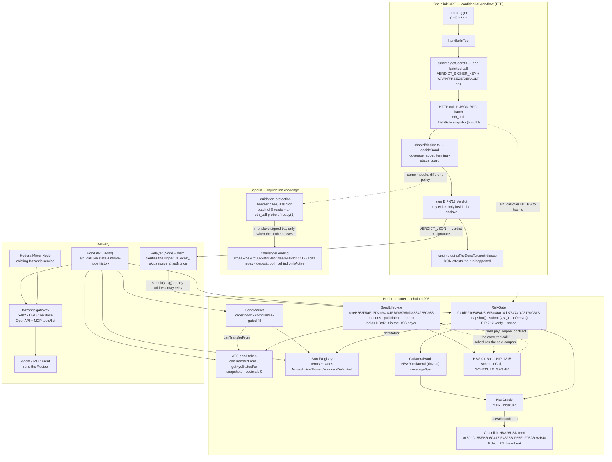
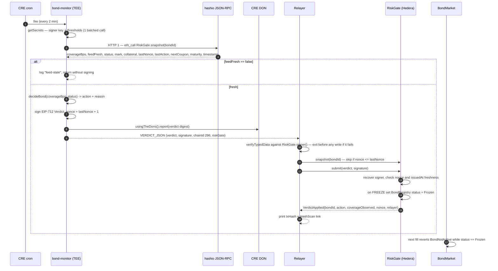

# Architecture

Three planes, one signature holds them together:

- **Hedera testnet (chainId 296)** — the bond, the order book, the collateral, the coupon schedule, and the gate
  that accepts risk verdicts.
- **Chainlink CRE** — a confidential workflow that reads Hedera over plain JSON-RPC from inside a TEE, decides
  with thresholds that never leave the enclave, and signs an EIP-712 verdict.
- **Delivery** — a relayer that lands the signed verdict on Hedera, and a Bond API that Bazantic turns into a
  paid, agent-callable service.

## System

`decide.ts` is shared by both workflows on purpose: the bond monitor and the liquidation defender are the same
shape of problem — a private threshold, a public observation, a bounded action — and reviewers can read one file
to audit both policies.

## The verdict path

Action codes: `0 OK · 1 WARN · 2 FREEZE · 3 DEFAULT`. Status codes:
`0 None · 1 Active · 2 Frozen · 3 Matured · 4 Defaulted`. `shouldDeliver` suppresses a FREEZE when the bond is
already `Frozen` and a DEFAULT when it is already `Defaulted`, so a repeated verdict does not burn gas;
`decideBond` returns `OK` for `Matured` and `Defaulted` because they are terminal, and for `None`, which means
no such bond — nothing is ever delivered for it. WARN is re-sent on every run
by design — it is a signal, not a state change.

## Why a relay

**Hedera is not a CRE-supported chain.** There is no chain writer, no EVM client target, and no on-chain report
consumer for chainId 296. The workflow therefore does two things a supported chain would hide:

1. **Reads** Hedera as raw JSON-RPC over the CRE HTTP client — one `eth_call` to `RiskGate.snapshot(bondId)`,
   batched into a single HTTP request because the enclave gets five HTTP calls per execution.
2. **Writes** nothing itself in the default configuration. It signs an EIP-712 `Verdict` with a private key that
   exists only as a CRE secret and is only ever materialised inside the enclave, and emits the verdict plus the
   signature as one log line.

That signature is the trust boundary. `RiskGate.submit` recovers the signer and compares it to `signer()`; it
does not care who sent the transaction. So the relayer is a dumb, replaceable, unprivileged courier: it holds a
funded Hedera key that can pay gas and nothing else. Anyone can run one. Losing the relayer key delays verdicts;
it cannot forge one. Replay is closed by the strictly increasing `nonce` (taken from the same snapshot the
decision used) and by an `issuedAt` freshness window.

`bond-monitor` also supports `deliver: "direct"`, where the enclave itself signs a legacy transaction with a
second secret (`HEDERA_SUBMIT_KEY`) and pushes `eth_sendRawTransaction` as its second HTTP call. The relay stays
the default for staging because the intermediate verdict is then inspectable — you can read the JSON, verify the
signature offline, and see exactly what the enclave concluded.

### What stays private, what becomes public

| Private — never leaves the enclave | Public — on-chain or in logs |
|---|---|
| `VERDICT_SIGNER_KEY`, `HEDERA_SUBMIT_KEY` | the signer's **address**, via `RiskGate.signer()` |
| `BOND_WARN_BPS`, `BOND_FREEZE_BPS`, `BOND_DEFAULT_BPS` — the actual policy | the `action` that resulted, and the `coverageObserved` that triggered it |
| the liquidation policy: `LIQ_TRIGGER_HF`, `LIQ_TARGET_HF`, repay/deposit caps, cooldown | the repay and deposit transactions themselves |
| the exact coverage in the workflow's own log line — bucketed to `>=150%` / `120-150%` / `100-120%` / `<100%` | `coverageObserved` in the verdict, because the contract needs it to be auditable |

The asymmetry is the point: an observer can verify **that** the freeze was justified by the coverage the verdict
carries, but cannot learn **where** the thresholds sit and therefore cannot trade against them. That is the
property a public order book cannot give you and a private spreadsheet cannot prove.

Practical consequences worth stating plainly:

- The enclave has secrets but **no signing primitive of its own** — signing is viem's
  `privateKeyToAccount(secret)` inside the TEE. The signature proves the key was used, not that a genuine
  enclave used it. Attestation binding is the missing piece and it is Chainlink's to provide
  (`docs/FEEDBACK/chainlink.md`).
- DEFAULT is a **coverage floor**, not a missed-payment grace period: runs are stateless, so there is nowhere to
  keep "coupon has been late for N days". A real deployment adds that state on-chain.
- Every run costs at most two HTTP calls (one in relay mode), which is what keeps the workflow inside the CRE
  budget with room for a retry.
