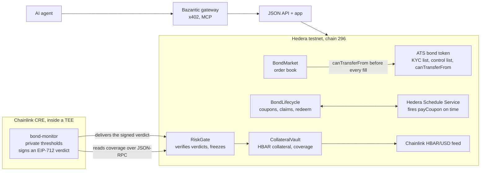

Bond Desk lives on three planes.

| Plane | What runs there | Why it is there |
|---|---|---|
| Hedera testnet | The bond tokens, the registry, the order book, the collateral vault, the oracle, the coupon lifecycle and the risk gate | Everything that holds value or enforces a rule is a contract on chain |
| Chainlink CRE | A confidential workflow in a trusted execution environment (TEE) | The risk policy has to stay private, and a signing key has to exist somewhere nobody can read |
| Delivery | A relayer, the JSON API, the app, and the Bazantic gateway | Hedera is not a CRE-supported chain, so verdicts need a courier; people and agents need a way in |

## What happens, in order

<Steps>
  <Step title="A bond is issued">
    The issuer calls the ATS factory that Hedera already runs on testnet. The factory deploys a security token
    with KYC switched on, a freeze list and transfer rules. The issuer grants KYC to itself and to approved
    investors, mints the supply to itself and registers the bond with the desk. [Bond token](/how-it-works/bond-token).
  </Step>
  <Step title="It trades on the order book">
    Anyone with KYC posts bids and asks. A fill asks the token whether the transfer is allowed, and only then
    moves USDC one way and bonds the other. [Order book](/how-it-works/order-book).
  </Step>
  <Step title="Coupons pay themselves">
    The issuer funds a USDC pool. The Hedera Schedule Service calls the lifecycle contract at the due second; the
    contract takes a snapshot of holders, records the coupon and schedules the next one from inside the same call.
    Holders claim their share. [Coupons](/how-it-works/coupons).
  </Step>
  <Step title="Collateral is valued live">
    The issuer locks HBAR in the vault. Coverage is the collateral's USD value, from the Chainlink feed, divided
    by the face value still outstanding. [Collateral](/how-it-works/collateral).
  </Step>
  <Step title="An enclave watches and signs">
    Every hour a confidential workflow reads the coverage, compares it with private thresholds and signs a
    verdict. The risk gate checks the signature and the nonce and, on FREEZE, halts trading.
    [Risk verdicts](/how-it-works/risk).
  </Step>
</Steps>

## What stays private, what is public

| Never leaves the enclave | Public, on chain or in logs |
|---|---|
| The verdict signer's private key | The signer's address, from `RiskGate.signer()` |
| The coverage thresholds for WARN, FREEZE and DEFAULT | The action that resulted |
| The exact coverage in the workflow's own log line (it logs a bucket) | The coverage the verdict carries, because the contract needs it to be auditable |

That asymmetry is the point. An observer can verify **that** a freeze was justified by the coverage the verdict
carries, but cannot learn **where** the thresholds sit, so nobody can trade against them.

## Why a relayer at all

Chainlink CRE has no chain writer for Hedera. Inside the enclave the only I/O primitive is an HTTP client, so the
workflow speaks JSON-RPC to Hedera directly for its one read, and its output is a signed message rather than a
transaction. The signature is the trust boundary: the gate checks who signed, not who sent. The deployed workflow
delivers its own verdicts with a second key; the relayer remains the courier for verdicts produced by the
simulator or re-sent from a log. [Relayer](/roles/relayer).
